## <1> 계층 설명

- domain-service에서 repository를 호출하고 여러가지 서비스 함수들을 구현하다보면 오히려 클린 아키텍처에서 추구하는 유스케이스에서 멀어진다고 생각했습니다. usecase의 역할을 도메인 서비스가 너무 많이 가져가는 느낌이 있었습니다.
- 그래서 domain-service에는 정책만 넣어두고 usecase에서 그걸 조합해서 사용하는 방식으로 구현했습니다.
- service, usecase, facade를 어떻게 구성하든 여러 레이어에서 조합해서 계속 위로 쌓아가는 구조라고 생각했습니다. 만약 동일 계층 순환참조를 원천 봉쇄하고 싶다면 usecase들에게 계층을 번호로 붙여서 DAG와 유사한 형식으로 구현해야한다고 결론을 지었습니다. 그래서 tier 구조를 도입했습니다.

### Tiered UseCase Architecture

\*예시) 일부 파일만 넣었습니다.

```mermaid
graph TD
    %% Presentation Layer
    subgraph "Presentation Layer"
        Order_Controller["OrderController"]
        User_Controller["UserController"]
    end

    %% Application Layer - Tiers
    subgraph "Application Layer (UseCases)"
        %% Tier-3
        subgraph "Tier-3"
            T3_PlaceOrder["PlaceOrderUseCase"]
        end

        %% Tier-2
        subgraph "Tier-2"
            T2_ProcessOrder["ProcessOrderUseCase"]
            T2_CreateUserWithWallet["CreateUserWithWalletUseCase"]
        end

        %% Tier-1
        subgraph "Tier-1"
            T1_CreateOrder["CreateOrderUseCase"]
            T1_UsePoints["UsePointsUseCase"]
            T1_CreateUser["CreateUserUseCase"]
            T1_CreateWallet["CreateWalletUseCase"]
        end
    end

    %% Domain Layer
    subgraph "Domain Layer"
        DS_ValidateOrder["ValidateOrderService"]
        DS_ValidateUser["ValidateUserService"]
        DS_ValidatePoint["ValidatePointService"]
    end


    %% Controller -> UseCase (어떤 tier든 직접 호출)
    Order_Controller -.-> T3_PlaceOrder
    User_Controller -.-> T2_CreateUserWithWallet
    Order_Controller -.-> T1_UsePoints

    %% UseCase Tier Dependencies (상위 -> 하위만)
    T3_PlaceOrder --> T2_ProcessOrder
    T2_ProcessOrder --> T1_CreateOrder
    T2_ProcessOrder --> T1_UsePoints
    T2_CreateUserWithWallet --> T1_CreateUser
    T2_CreateUserWithWallet --> T1_CreateWallet

    %% UseCase -> Domain Service
    T1_CreateOrder --> DS_ValidateOrder
    T1_UsePoints --> DS_ValidatePoint
    T1_CreateUser --> DS_ValidateUser

    %% 색상 및 스타일
    classDef controller fill:#333,stroke:#01579b,stroke-width:2px
    classDef tier3 fill:#333,stroke:#e65100,stroke-width:2px
    classDef tier2 fill:#333,stroke:#4a148c,stroke-width:2px
    classDef tier1 fill:#333,stroke:#1b5e20,stroke-width:2px
    classDef service fill:#333,stroke:#ff6f00,stroke-width:2px
    classDef repo fill:#333,stroke:#880e4f,stroke-width:2px

    class Controller controller
    class T3_PlaceOrder tier3
    class T2_ProcessOrder,T2_CreateUserWithWallet tier2
    class T1_CreateOrder,T1_UsePoints,T1_CreateUser,T1_CreateWallet tier1
    class DS_ValidateOrder,DS_ValidateUser,DS_ValidatePoint service
    class Repo_Order,Repo_User,Repo_Point repo
```



### 규칙 설명

- 상위 티어는 하위티어만 import할 수 있도록 eslint를 설정해두었습니다.
- presentation 레이어에서는 티어 상관없이 바로 가져다가 사용할 수 있습니다.
- 티어는 무한히 쌓을 수 있습니다.
- 아래 완화책에 나온 것처럼 여러 장치를 마련해서 티어들에 추가적인 규칙을 부여할 수 있습니다.

## <2> 한계점 + 생각해본 완화책

### 도메인 엉킴

- 나중에 도메인을 똑 떼고 싶은데 usecase 끼리 특정 계층부터 엉켜있을 가능성이 존재합니다.
- 그때의 혼돈을 최소화하려면 "특정 tier 미만은 무조건 도메인 내에서만 호출"과 같은 규칙을 도입할 수 있습니다.

### 파일 이름의 구분성

- tiered 구조에서는 기존에 XService, YUsecase, ZFacade에 존재하던 prefix 이름이 사라졌기 때문에 묶음 구분이 어려울 수 있습니다.
- 이걸 완화하려면 각 티어에 object literal map을 두거나하여 usecsae 위계에 이름을 부여할 수 있습니다.
- 혹은 폴더 구조로 동일 티어 내에서 usecase를 묶을 수도 있습니다.

```ts
const ZFacade = {
  ZZUsecase: ZZUsecase
  ZZZUsecsae: ZZZUsecsae
  ZZZZUsecsae: ZZZZUsecsae
}
```

### 유스케이스 이름이 길어짐

여러 유스케이스를 조합할 때 거의 동일한 동작을 하는데 이름을 구분하기 위해 이름이 길어지기도 합니다. 예시:

- createuserWithbalance:
  - 사용하는 유스케이스 조합:
    - createuser
    - createBalance
- getpopularproductsWithDetail:
  - 사용하는 유스케이스 조합:
    - getPopularProducts
    - getProductInfo

이것을 완화하는 뚜렷한 방법은 못찾았습니다. 그나마 위에서 이야기한 파일 이름의 구분성 해결책에 조금 의존할 수 있긴합니다.

### 트랜잭션에 의해 usecase 형태가 영향을 받음

- 경우가 안 좋으면 트랜잭션에 따라서 유스케이스 형태가 바뀌어야합니다.
- 그나마 트랜잭션에서 완화할 수 있는 방향은 특정 usecase가 트랜잭션에 포함되면 에러를 던지도록 커스텀 데코레이터를 만드는 것 정도는 생각해보았습니다.
