# 시퀀스 다이어그램

## 중요도 나열

| 시나리오 번호 | 시나리오 설명                        | 중요도 | 이유                                                               |
| ------------- | ------------------------------------ | ------ | ------------------------------------------------------------------ |
| 4-1           | **정상 결제 흐름**                   | **상** | 시스템의 핵심 비즈니스 플로우. 모든 요소(잔액, 쿠폰, 재고 등) 연계 |
| 4-5           | **결제 중 오류 → 보류 처리 및 복구** | **상** | 예외 발생 시 신뢰 보장 핵심. 원자성·복구 로직 검증 필요            |
| 6-1           | **중복 결제 요청 방지**              | **상** | 결제 이중 처리 방지 필수. 장애 발생 가능성 높음                    |
| 1-1           | 잔액 충전 성공 및 잔액 조회          | 중     | 필수 기능이지만 상대적으로 단순. 예외 흐름 없음                    |
| 1-2           | 잔액 충전 실패 (단위, 금액 초과 등)  | 중     | UX적으로 중요. 서버 단에서 검증 처리 필요                          |
| 3-1           | 쿠폰 발급 성공                       | 중     | 선착순 조건 시 유저 경험 영향. 하지만 구조는 단순                  |
| 3-2           | 쿠폰 발급 실패 (소진, 중복 등)       | 중     | 빈도 높은 예외. 정책 상 복잡성 있음                                |
| 4-2           | 주문 실패 - 잔액 부족                | 중     | 자주 발생 가능. 단순하지만 빠른 응답 필요                          |
| 4-3           | 주문 실패 - 재고 부족                | 중     | 인기 상품일수록 빈도 높음. 동시성 주의 필요                        |
| 4-4           | 주문 실패 - 쿠폰 오류                | 중     | 쿠폰 조건이 다양할 경우 정책 오류 가능성 있음                      |
| 5-1           | 보류 주문 → 1분 후 자동 복구         | 중     | 백엔드 로직 중요. 사용자 불신 방지 포인트                          |
| 2-1           | 전체 상품 목록 조회                  | 하     | 단순 조회. 실패해도 장애 영향 적음                                 |
| 2-2           | 단일 상품 상세 조회                  | 하     | 동일. 404 외 특별한 로직 없음                                      |
| 7-1           | 인기 상품 조회                       | 하     | 비핵심 기능. 마케팅 성격 강함                                      |

## 전제 사항

- JWT 토큰 사용

## 시나리오 별 시퀀스 다이어그램

1. 잔액 충전 & 조회 흐름

## 1. 잔액 충전 & 조회 흐름

### 1-1. [성공] 충전 요청 성공 → 잔액 반영 → 조회

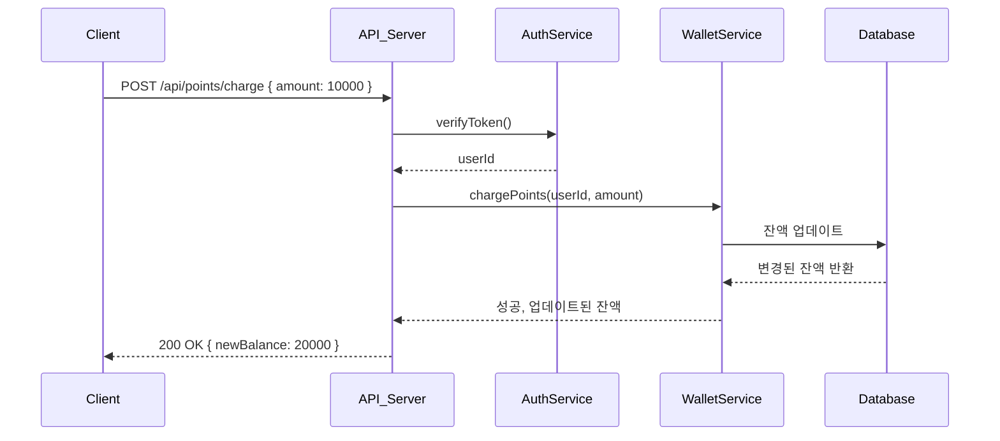

---

### 1-2. [실패] 충전 실패 (단위 미만, 한도 초과 등)

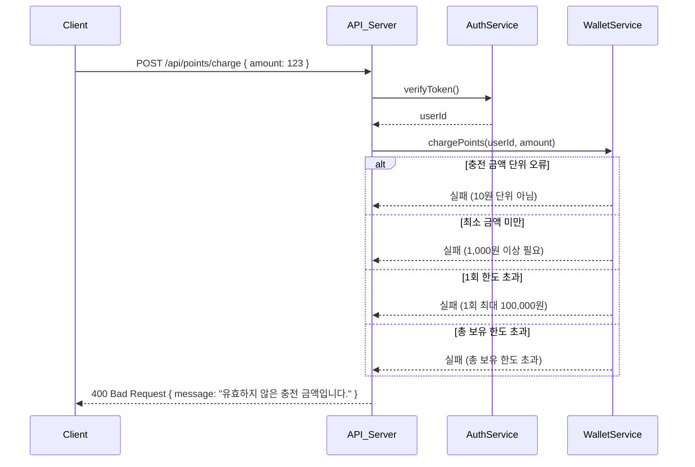

2. 상품 목록 및 단일 조회

## 2. 상품 목록 및 단일 조회

### 2-1. [성공] 전체 상품 조회

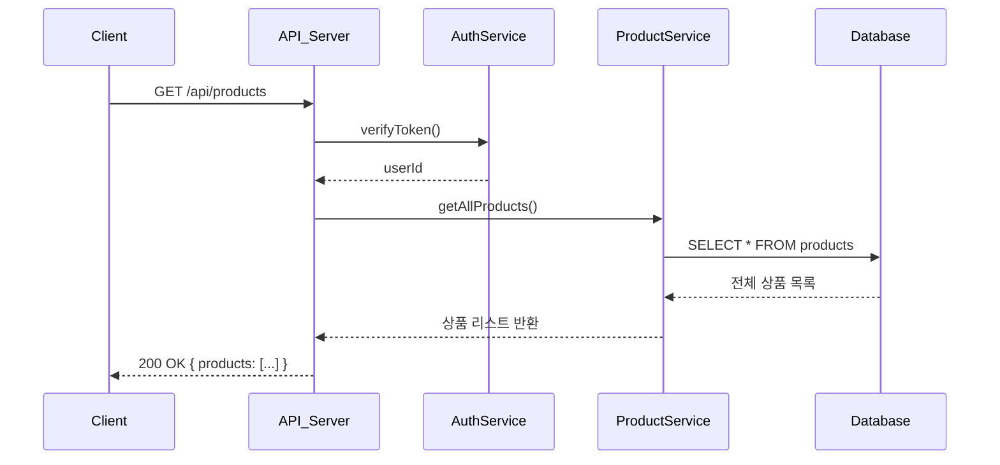

### 2-2. [성공/실패] 단일 상품 상세 조회

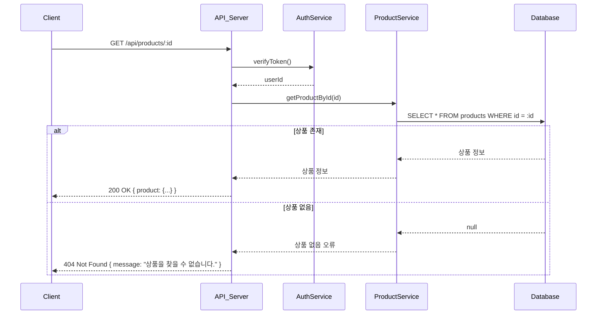

3. 쿠폰 발급 및 조회

## 3. 쿠폰 발급 및 조회

### 3-1. [성공] 선착순 쿠폰 발급 → 보유 쿠폰 조회

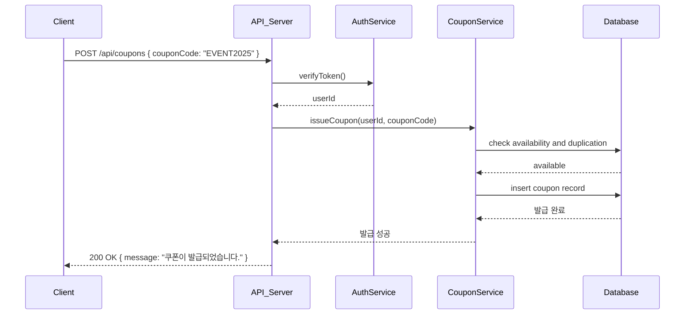

### 3-2. [실패] 발급 실패

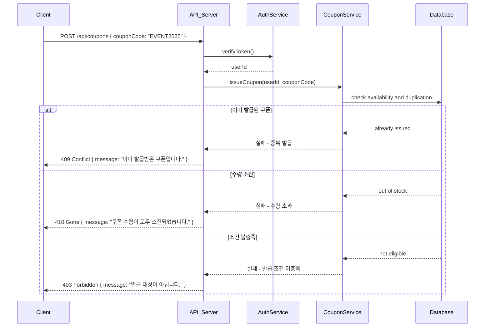

- 수량 소진
- 이미 발급받은 쿠폰
- 발급 조건 미달

4. 결제 프로세스 (전체 흐름)

## 4. 결제 프로세스 (전체 흐름)

### 4-1. [성공] 정상 주문 → 재고/쿠폰/잔액 확보 → 결제 완료

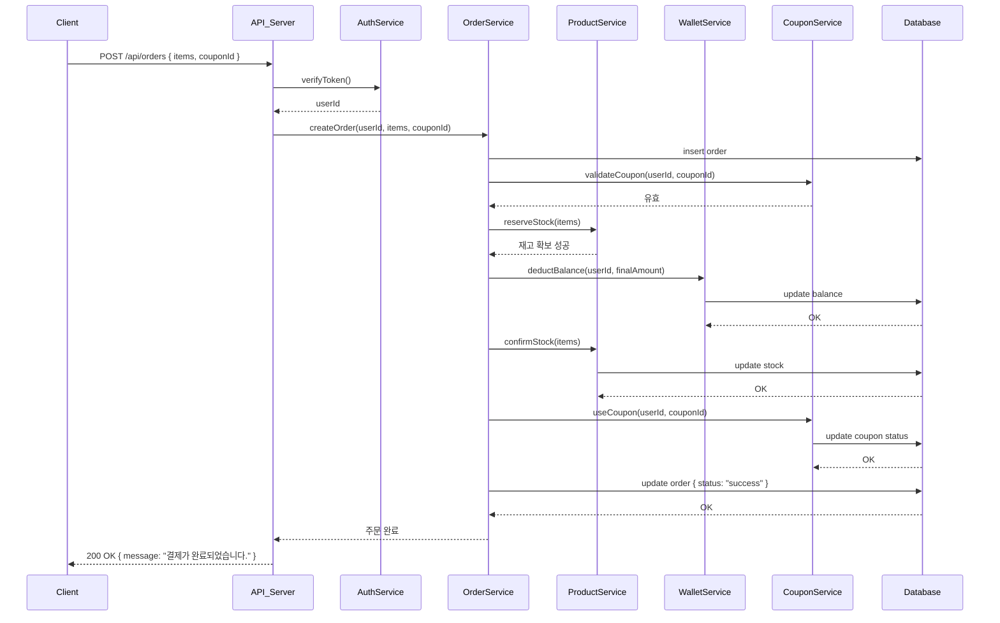

쿠폰 → 잔액 순 차감
주문 상태: 결제 완료

### 4-2. [실패] 잔액 부족

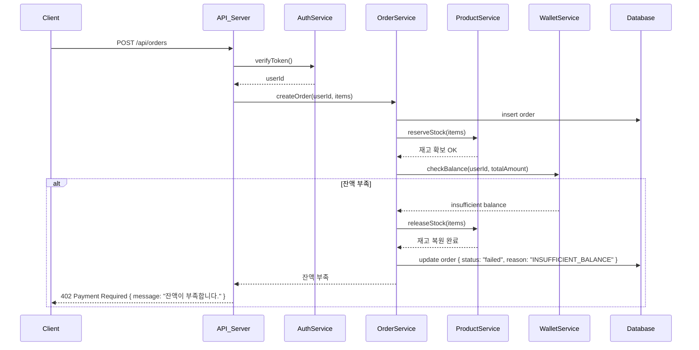

결제 불가 → 주문 실패
재고/쿠폰 확보 안 됨

### 4-3. [실패] 재고 부족

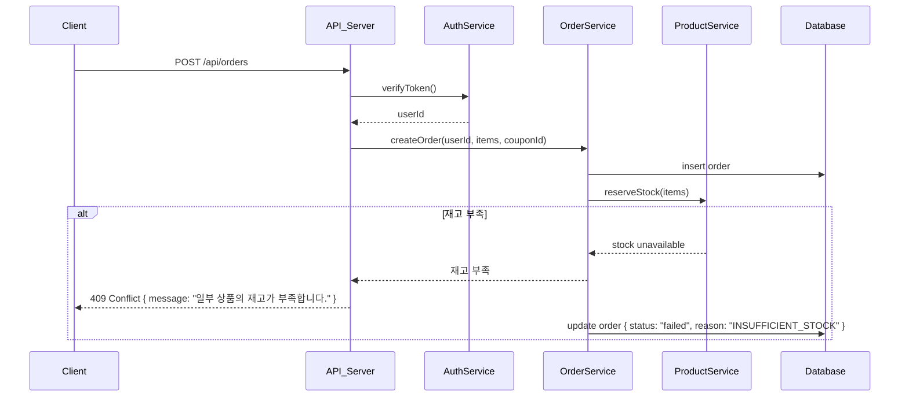

잔액 충분 → 재고 확보 실패
주문 실패

### 4-4. [실패] 쿠폰 무효

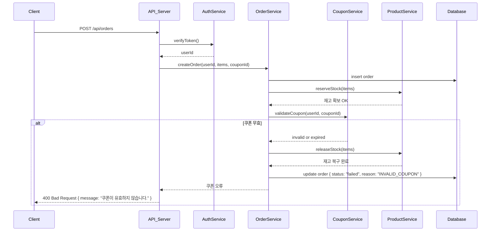

쿠폰 만료, 조건 미충족 등 → 주문 실패

### 4-5. [실패] 결제 중 시스템 오류

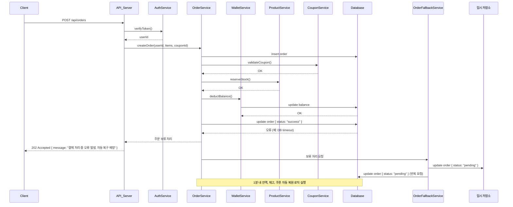

결제 처리 중 네트워크/DB 오류
주문 상태: 보류
이후 1분 내 잔액/재고/쿠폰 복구 로직 실행

5. 보류 주문 → 자동 복구 흐름

## 5. 보류 주문 → 자동 복구 흐름

### 5-1. 주문 보류 → 타이머 만료 → 자동 복구

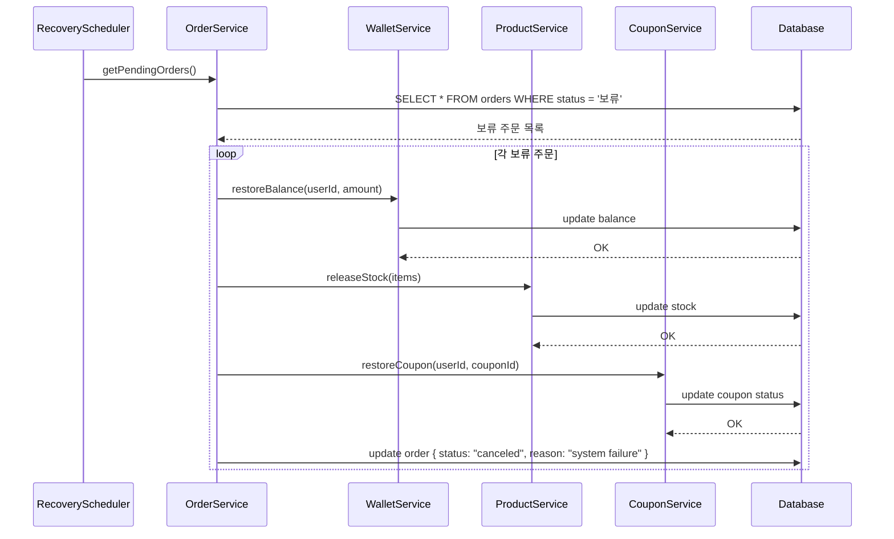

잔액 복원
재고 되돌림
쿠폰 복구

6. 중복 결제 요청 방지

## 6. 중복 결제 요청 방지

### 6-1. 같은 주문 재요청 시 중복 방지 응답

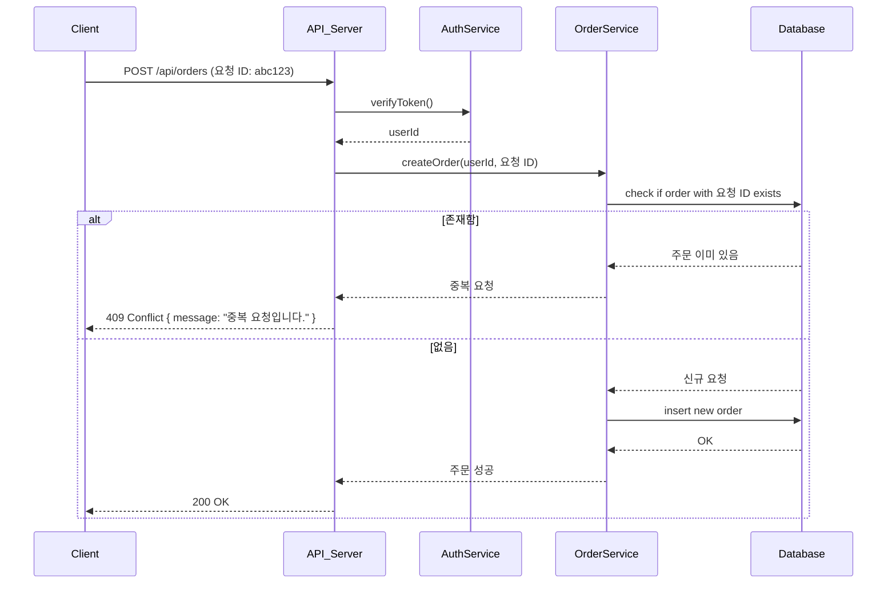

요청 ID or 타임스탬프 기반 비교
응답: “이미 처리 중입니다”

7. 인기 상품 조회

## 7. 인기 상품 조회

### 7-1. [정상] 최근 3일 기준 인기 상품 조회

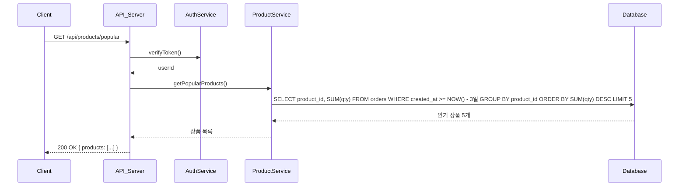

단순 조회로, 실패 시나리오는 생략 가능

