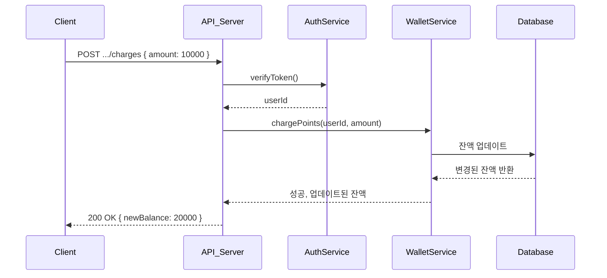
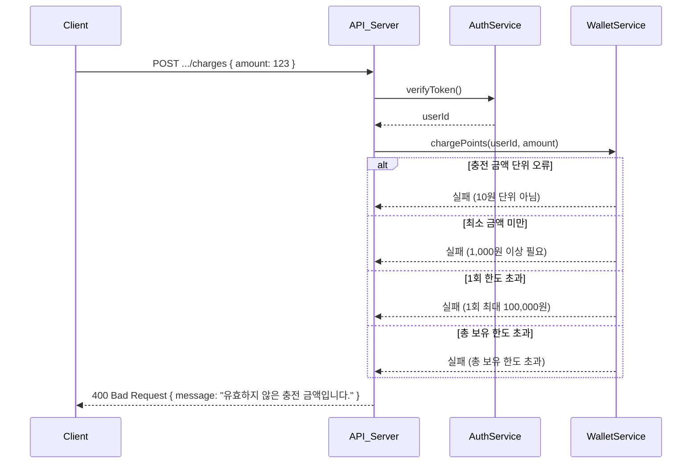

# 잔액 충전 & 조회 흐름

## 1-1. [성공] 충전 요청 성공 → 잔액 반영 → 조회

엔드포인트: `POST /api/users/me/points/charges`



---

## 1-2. [실패] 충전 실패 (단위 미만, 한도 초과 등)

엔드포인트: `POST /api/users/me/points/charges`



---

## 동시성 문제 해결방안

### 중복 충전 방지: 멱등성 키 (Idempotency Key)

#### 문제 상황

- 사용자가 충전 버튼을 빠르게 여러 번 클릭
- 네트워크 지연으로 인한 중복 요청

#### 해결 방안

- 클라이언트에서 요청 시 고유한 `requestId` 포함
- 서버에서 `requestId`를 이용해 중복 요청 식별
- 이미 처리된 요청은 기존 결과 반환

```typescript
// 클라이언트 요청 예시
POST /api/points/charge
{
  "amount": 10000,
  "requestId": "charge_user123_20231201_001"
}

// 서버 처리 로직
async chargePoints(userId: string, amount: number, requestId: string) {
  // 중복 요청 체크
  const existingResult = await this.checkDuplicateRequest(requestId);
  if (existingResult) {
    return existingResult;
  }

  // 충전 처리 후 결과 저장
  const result = await this.processCharge(userId, amount);
  await this.saveRequestResult(requestId, result);

  return result;
}
```
