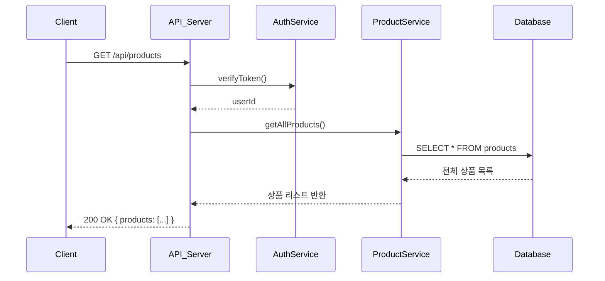
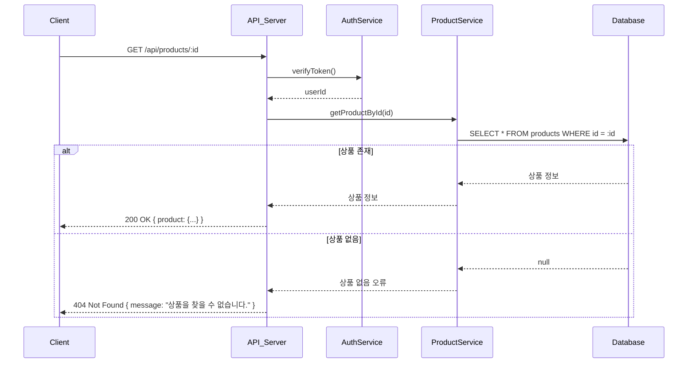

# 상품 목록 및 단일 조회

엔드포인트: `GET /api/products`

## 2-1. [성공] 전체 상품 조회

```mermaid
sequenceDiagram
    participant Client
    participant API_Server
    participant AuthService
    participant ProductService
    participant Database

    Client->>API_Server: GET /api/products
    API_Server->>AuthService: verifyToken()
    AuthService-->>API_Server: userId

    API_Server->>ProductService: getAllProducts()
    ProductService->>Database: SELECT * FROM products
    Database-->>ProductService: 전체 상품 목록

    ProductService-->>API_Server: 상품 리스트 반환
    API_Server-->>Client: 200 OK { products: [...] }
```

---

## 2-2. [성공/실패] 단일 상품 상세 조회

엔드포인트: `GET /api/products/:productId`

```mermaid
sequenceDiagram
    participant Client
    participant API_Server
    participant AuthService
    participant ProductService
    participant Database

    Client->>API_Server: GET /api/products/:id
    API_Server->>AuthService: verifyToken()
    AuthService-->>API_Server: userId

    API_Server->>ProductService: getProductById(id)
    ProductService->>Database: SELECT * FROM products WHERE id = :id

    alt 상품 존재
        Database-->>ProductService: 상품 정보
        ProductService-->>API_Server: 상품 정보
        API_Server-->>Client: 200 OK { product: {...} }
    else 상품 없음
        Database-->>ProductService: null
        ProductService-->>API_Server: 상품 없음 오류
        API_Server-->>Client: 404 Not Found { message: "상품을 찾을 수 없습니다." }
    end
```
