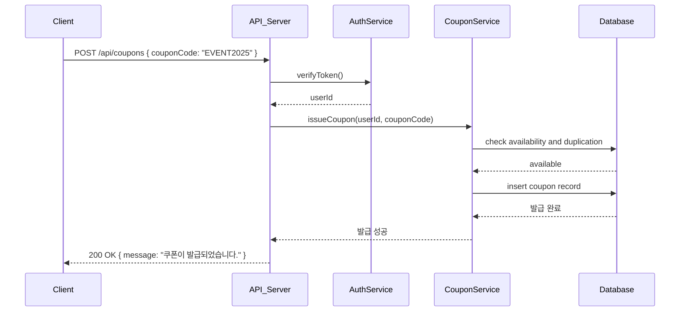
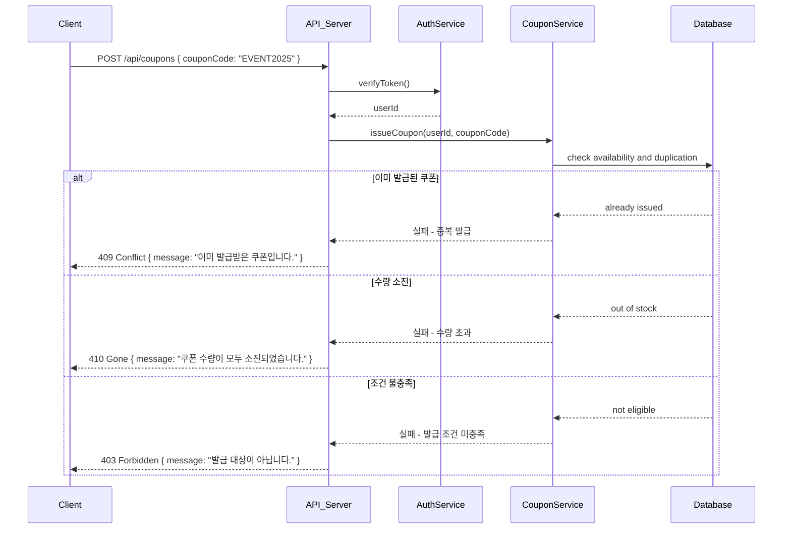
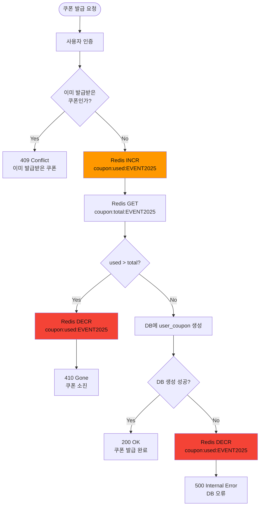
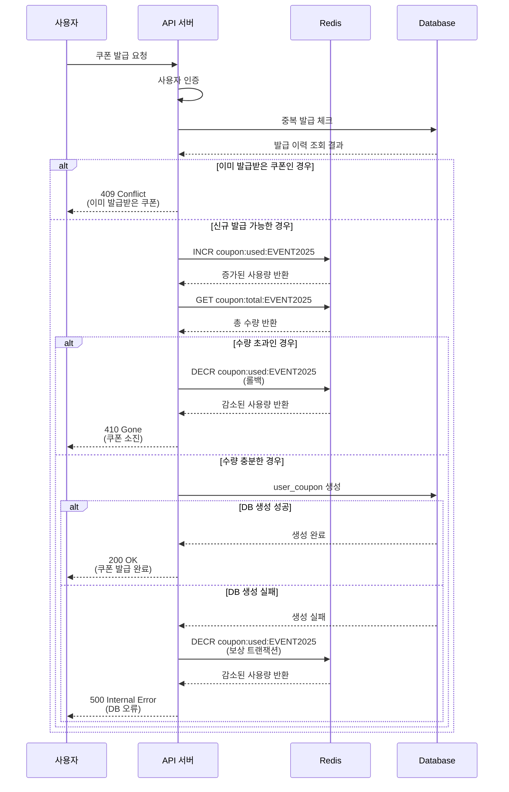

# 쿠폰 발급 및 조회

## 3-1. [성공] 선착순 쿠폰 발급 → 보유 쿠폰 조회



---

## 3-2. [실패] 발급 실패



---

## 동시성 문제 해결방안

### 선착순 쿠폰 발급 시 동시성 문제

#### 문제 상황

선착순 쿠폰 발급 시 여러 인스턴스가 동시에 같은 쿠폰의 발급 가능 여부를 확인하고 발급하려고 시도하는 경우

#### 해결 방안: Redis 원자적 연산 (INCR)

##### 플로우차트



##### 시퀀스 다이어그램



#### 구현 예시

```typescript
async issueCoupon(userId: string, couponCode: string) {
  // 1. 중복 발급 체크
  const existingCoupon = await this.findUserCoupon(userId, couponCode);
  if (existingCoupon) {
    throw new ConflictException('이미 발급받은 쿠폰입니다');
  }

  // 2. 원자적 증가
  const usedCount = await this.redis.incr(`coupon:used:${couponCode}`);
  const totalCount = await this.redis.get(`coupon:total:${couponCode}`);

  // 3. 수량 초과 체크
  if (usedCount > parseInt(totalCount)) {
    await this.redis.decr(`coupon:used:${couponCode}`);
    throw new GoneException('쿠폰이 모두 소진되었습니다');
  }

  try {
    // 4. DB에 사용자 쿠폰 생성
    return await this.createUserCoupon(userId, couponCode);
  } catch (error) {
    // 5. DB 실패 시 보상 트랜잭션
    await this.redis.decr(`coupon:used:${couponCode}`);
    throw error;
  }
}
```
