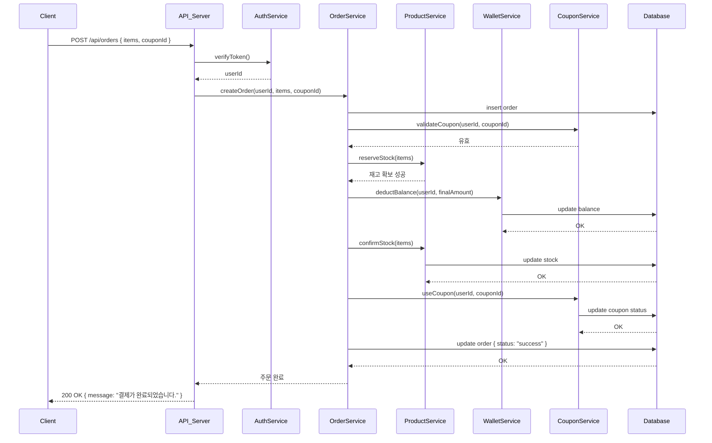
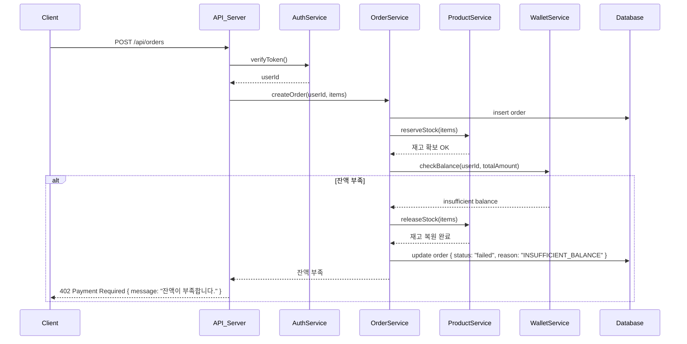
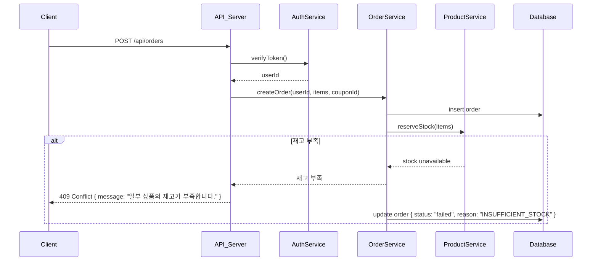
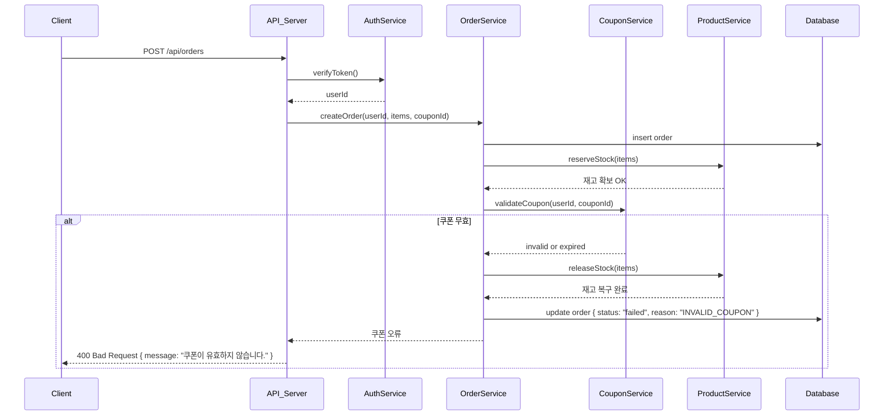
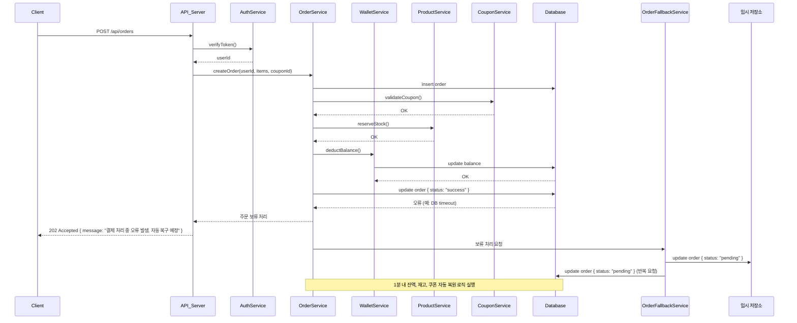

# 결제 프로세스 (전체 흐름)

## 4-1. [성공] 정상 주문 → 재고/쿠폰/잔액 확보 → 결제 완료

---

## 4-2. [실패] 잔액 부족

---

## 4-3. [실패] 재고 부족

### 재고 부족 시 동시성 해결방안

- **문제**: 인기 상품의 경우 동시에 여러 사용자가 주문을 시도할 수 있음
- **해결됨**: Reserve/Release 패턴으로 DB 필드 구현
  - `reserveStock()`: 재고 예약 (원자적 처리)
  - `confirmStock()`: 재고 차감 확정
  - `releaseStock()`: 재고 예약 해제
- **장점**: DB 레벨에서 동시성 제어, race condition 방지

---

## 4-4. [실패] 쿠폰 무효

---

## 4-5. [실패] 결제 중 시스템 오류

