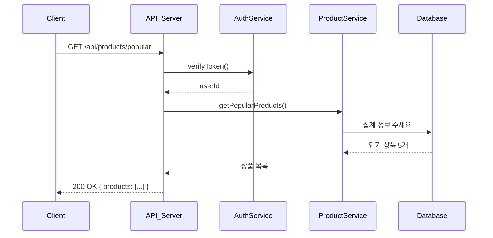

# 인기 상품 조회

## 7-1. [정상] 최근 3일 기준 인기 상품 조회

엔드포인트: `GET /api/products/popular`

### 특징

- 단순 조회로, 실패 시나리오는 생략 가능
- 최근 3일 주문 기준 상위 5개 상품 조회
- 구현은 postgres면 materialized view, mysql이면 집계 테이블 정도로 하면 될듯..?
