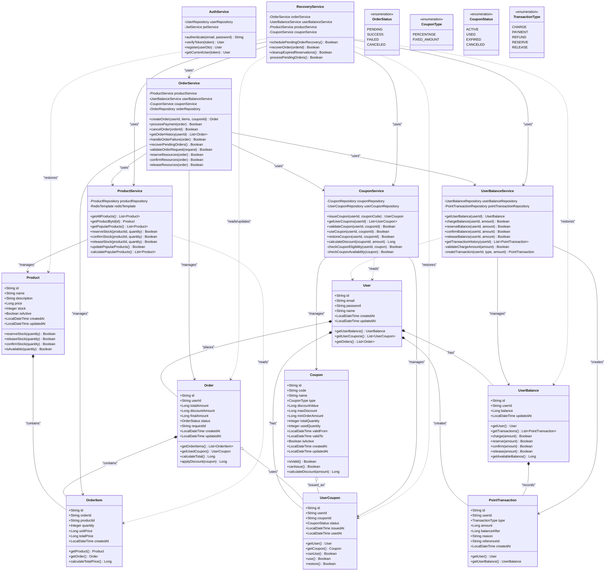

# 클래스 다이어그램

## 전체 시스템 클래스 다이어그램



## 주요 클래스 설명

### 1. 엔티티 클래스

#### User (사용자)

- 시스템 사용자 정보
- 잔액, 쿠폰, 주문 이력과 연관

#### Product (상품)

- 상품 정보 및 재고 관리
- 재고 예약/확정/해제 메소드 제공

#### Order (주문)

- 주문 정보 및 상태 관리
- 할인 적용 및 총액 계산 로직 포함

#### OrderItem (주문 항목)

- 주문 내 개별 상품 정보
- 수량 및 가격 계산

#### Coupon (쿠폰)

- 쿠폰 정보 및 할인 규칙
- 발급 가능 여부 및 할인 계산 로직

#### UserCoupon (사용자 쿠폰)

- 사용자별 쿠폰 발급 및 사용 이력
- 쿠폰 상태 관리

#### UserBalance (사용자 잔액)

- 사용자 잔액 및 예약 잔액 관리
- 충전/예약/확정/해제 메소드 제공

#### PointTransaction (포인트 거래)

- 모든 잔액 변동 이력 기록
- 감사 추적 및 복구 지원

### 2. 서비스 클래스

#### OrderService

- 주문 생성 및 결제 처리 핵심 로직
- 리소스 예약/확정/해제 orchestration

#### ProductService

- 상품 조회 및 재고 관리
- 인기 상품 통계 처리

#### UserBalanceService

- 잔액 충전 및 결제 처리
- 거래 이력 관리

#### CouponService

- 쿠폰 발급 및 사용 처리
- 할인 계산 로직

#### RecoveryService

- 보류 주문 자동 복구
- 만료된 예약 정리

### 3. 주요 설계 특징

1. **원자성 보장**: 모든 리소스 변경은 예약→확정→해제 패턴 사용
2. **복구 가능성**: 모든 상태 변경 추적 및 복구 로직 제공
3. **동시성 제어**: 재고 및 잔액 예약 시스템으로 동시성 문제 해결
4. **확장성**: 서비스 계층 분리로 각 도메인 독립적 확장 가능
5. **금액 처리**: 모든 금액을 정수(Long)로 처리하여 부동소수점 오차 방지

### 4. 할인 처리 방식

#### 할인율 쿠폰 예시

```java
// 10% 할인 쿠폰 적용
long originalAmount = 1235L;  // 1,235원
int discountRate = 10;        // 10%
long discountAmount = originalAmount * discountRate / 100;  // 123원
long finalAmount = originalAmount - discountAmount;         // 1,112원
```

#### 정액 할인 쿠폰 예시

```java
// 2,000원 할인 쿠폰 적용
long originalAmount = 5000L;  // 5,000원
long discountAmount = 2000L;  // 2,000원
long finalAmount = originalAmount - discountAmount;  // 3,000원
```

#### 장점

- 부동소수점 오차 완전 방지
- 정수 연산으로 성능 향상
- 소수점 버림 정책으로 안정성 보장
