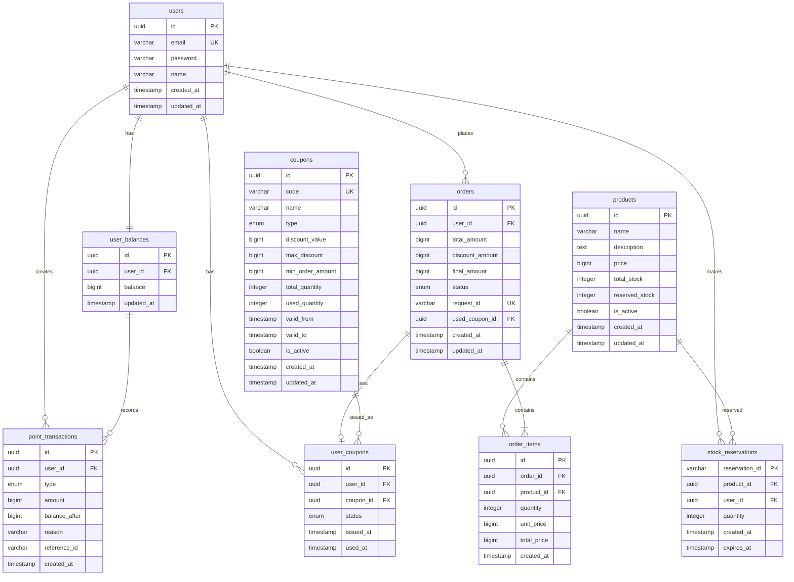

# ERD (Entity Relationship Diagram)

## 전체 시스템 ERD

## 테이블 정의

### 1. users (사용자)

| 컬럼       | 타입         | 제약조건                  | 설명               |
| ---------- | ------------ | ------------------------- | ------------------ |
| id         | UUID         | PRIMARY KEY               | 사용자 ID          |
| email      | VARCHAR(255) | UNIQUE, NOT NULL          | 이메일 (로그인 ID) |
| password   | VARCHAR(255) | NOT NULL                  | 암호화된 비밀번호  |
| name       | VARCHAR(100) | NOT NULL                  | 사용자 이름        |
| created_at | TIMESTAMP    | DEFAULT CURRENT_TIMESTAMP | 생성일시           |
| updated_at | TIMESTAMP    | DEFAULT CURRENT_TIMESTAMP | 수정일시           |

### 2. products (상품)

| 컬럼           | 타입         | 제약조건                  | 설명                |
| -------------- | ------------ | ------------------------- | ------------------- |
| id             | UUID         | PRIMARY KEY               | 상품 ID             |
| name           | VARCHAR(255) | NOT NULL                  | 상품명              |
| description    | TEXT         |                           | 상품 설명           |
| price          | BIGINT       | NOT NULL                  | 상품 가격 (원 단위) |
| total_stock    | INTEGER      | NOT NULL, DEFAULT 0       | 총 재고 수량        |
| reserved_stock | INTEGER      | DEFAULT 0                 | 예약된 재고 수량    |
| is_active      | BOOLEAN      | NOT NULL, DEFAULT TRUE    | 활성화 상태         |
| created_at     | TIMESTAMP    | DEFAULT CURRENT_TIMESTAMP | 생성일시            |
| updated_at     | TIMESTAMP    | DEFAULT CURRENT_TIMESTAMP | 수정일시            |

### 3. orders (주문)

| 컬럼            | 타입         | 제약조건                  | 설명                                           |
| --------------- | ------------ | ------------------------- | ---------------------------------------------- |
| id              | UUID         | PRIMARY KEY               | 주문 ID                                        |
| user_id         | UUID         | NOT NULL, FOREIGN KEY     | 사용자 ID                                      |
| total_amount    | BIGINT       | NOT NULL                  | 총 주문 금액                                   |
| discount_amount | BIGINT       | DEFAULT 0                 | 할인 금액                                      |
| final_amount    | BIGINT       | NOT NULL                  | 최종 결제 금액                                 |
| status          | ENUM         | NOT NULL                  | 주문 상태 (PENDING, SUCCESS, FAILED, CANCELED) |
| request_id      | VARCHAR(255) | UNIQUE, NOT NULL          | 중복 요청 방지 ID                              |
| used_coupon_id  | UUID         | FOREIGN KEY               | 사용된 쿠폰 ID                                 |
| created_at      | TIMESTAMP    | DEFAULT CURRENT_TIMESTAMP | 생성일시                                       |
| updated_at      | TIMESTAMP    | DEFAULT CURRENT_TIMESTAMP | 수정일시                                       |

### 4. order_items (주문 항목)

| 컬럼        | 타입      | 제약조건                  | 설명         |
| ----------- | --------- | ------------------------- | ------------ |
| id          | UUID      | PRIMARY KEY               | 주문 항목 ID |
| order_id    | UUID      | NOT NULL, FOREIGN KEY     | 주문 ID      |
| product_id  | UUID      | NOT NULL, FOREIGN KEY     | 상품 ID      |
| quantity    | INTEGER   | NOT NULL                  | 주문 수량    |
| unit_price  | BIGINT    | NOT NULL                  | 단가         |
| total_price | BIGINT    | NOT NULL                  | 항목 총 가격 |
| created_at  | TIMESTAMP | DEFAULT CURRENT_TIMESTAMP | 생성일시     |

### 5. coupons (쿠폰)

| 컬럼             | 타입         | 제약조건                  | 설명                                 |
| ---------------- | ------------ | ------------------------- | ------------------------------------ |
| id               | UUID         | PRIMARY KEY               | 쿠폰 ID                              |
| code             | VARCHAR(50)  | UNIQUE, NOT NULL          | 쿠폰 코드                            |
| name             | VARCHAR(255) | NOT NULL                  | 쿠폰명                               |
| type             | ENUM         | NOT NULL                  | 할인 타입 (PERCENTAGE, FIXED_AMOUNT) |
| discount_value   | BIGINT       | NOT NULL                  | 할인값 (% 또는 고정금액)             |
| max_discount     | BIGINT       |                           | 최대 할인 금액                       |
| min_order_amount | BIGINT       | DEFAULT 0                 | 최소 주문 금액                       |
| total_quantity   | INTEGER      | NOT NULL                  | 총 발급 수량                         |
| used_quantity    | INTEGER      | DEFAULT 0                 | 사용된 수량                          |
| valid_from       | TIMESTAMP    | NOT NULL                  | 유효 시작일                          |
| valid_to         | TIMESTAMP    | NOT NULL                  | 유효 종료일                          |
| is_active        | BOOLEAN      | NOT NULL, DEFAULT TRUE    | 활성화 상태                          |
| created_at       | TIMESTAMP    | DEFAULT CURRENT_TIMESTAMP | 생성일시                             |
| updated_at       | TIMESTAMP    | DEFAULT CURRENT_TIMESTAMP | 수정일시                             |

### 6. user_coupons (사용자 쿠폰)

| 컬럼      | 타입      | 제약조건                  | 설명                                   |
| --------- | --------- | ------------------------- | -------------------------------------- |
| id        | UUID      | PRIMARY KEY               | 사용자 쿠폰 ID                         |
| user_id   | UUID      | NOT NULL, FOREIGN KEY     | 사용자 ID                              |
| coupon_id | UUID      | NOT NULL, FOREIGN KEY     | 쿠폰 ID                                |
| status    | ENUM      | NOT NULL                  | 상태 (ACTIVE, USED, EXPIRED, CANCELED) |
| issued_at | TIMESTAMP | DEFAULT CURRENT_TIMESTAMP | 발급일시                               |
| used_at   | TIMESTAMP |                           | 사용일시                               |

### 7. user_balances (사용자 잔액)

| 컬럼       | 타입      | 제약조건                  | 설명             |
| ---------- | --------- | ------------------------- | ---------------- |
| id         | UUID      | PRIMARY KEY               | 잔액 ID          |
| user_id    | UUID      | UNIQUE, NOT NULL, FK      | 사용자 ID        |
| balance    | BIGINT    | NOT NULL, DEFAULT 0       | 사용 가능한 잔액 |
| updated_at | TIMESTAMP | DEFAULT CURRENT_TIMESTAMP | 수정일시         |

### 8. point_transactions (포인트 거래)

| 컬럼          | 타입         | 제약조건                  | 설명                               |
| ------------- | ------------ | ------------------------- | ---------------------------------- |
| id            | UUID         | PRIMARY KEY               | 거래 ID                            |
| user_id       | UUID         | NOT NULL, FOREIGN KEY     | 사용자 ID                          |
| type          | ENUM         | NOT NULL                  | 거래 타입 (CHARGE, DEDUCT, REFUND) |
| amount        | BIGINT       | NOT NULL                  | 거래 금액                          |
| balance_after | BIGINT       | NOT NULL                  | 거래 후 잔액                       |
| reason        | VARCHAR(255) |                           | 거래 사유                          |
| reference_id  | VARCHAR(255) |                           | 참조 ID (주문 ID 등)               |
| created_at    | TIMESTAMP    | DEFAULT CURRENT_TIMESTAMP | 생성일시                           |

### 9. stock_reservations (재고 예약)

| 컬럼           | 타입         | 제약조건                  | 설명                        |
| -------------- | ------------ | ------------------------- | --------------------------- |
| reservation_id | VARCHAR(255) | PRIMARY KEY               | 예약 ID (UUID 또는 복합키)  |
| product_id     | UUID         | NOT NULL, FOREIGN KEY     | 상품 ID                     |
| user_id        | UUID         | NOT NULL, FOREIGN KEY     | 사용자 ID                   |
| quantity       | INTEGER      | NOT NULL                  | 예약 수량                   |
| created_at     | TIMESTAMP    | DEFAULT CURRENT_TIMESTAMP | 예약 생성일시               |
| expires_at     | TIMESTAMP    | NOT NULL                  | 예약 만료일시 (생성 + 30초) |
