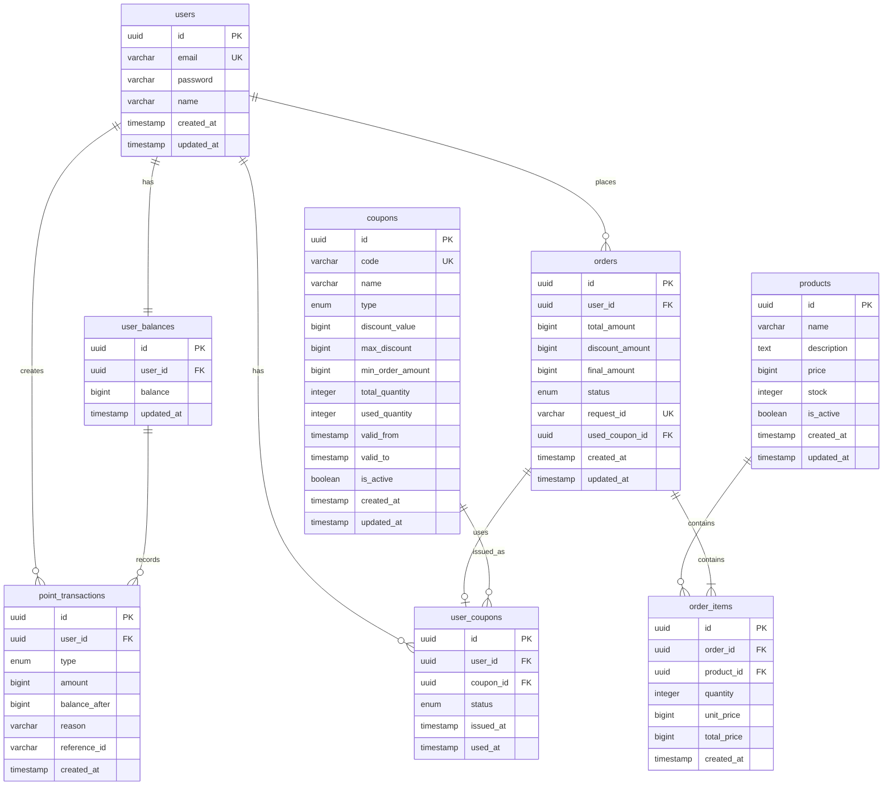

# ERD (Entity Relationship Diagram)

## 전체 시스템 ERD

## 테이블 상세 정의

### 1. users (사용자)

| 컬럼       | 타입         | 제약조건                                              | 설명               |
| ---------- | ------------ | ----------------------------------------------------- | ------------------ |
| id         | UUID         | PRIMARY KEY, DEFAULT uuid_generate_v4()               | 사용자 ID          |
| email      | VARCHAR(255) | UNIQUE, NOT NULL                                      | 이메일 (로그인 ID) |
| password   | VARCHAR(255) | NOT NULL                                              | 암호화된 비밀번호  |
| name       | VARCHAR(100) | NOT NULL                                              | 사용자 이름        |
| created_at | TIMESTAMP    | DEFAULT CURRENT_TIMESTAMP                             | 생성일시           |
| updated_at | TIMESTAMP    | DEFAULT CURRENT_TIMESTAMP ON UPDATE CURRENT_TIMESTAMP | 수정일시           |

**인덱스:**

- `idx_users_email` (email)

### 2. products (상품)

| 컬럼        | 타입         | 제약조건                                              | 설명                |
| ----------- | ------------ | ----------------------------------------------------- | ------------------- |
| id          | UUID         | PRIMARY KEY, DEFAULT uuid_generate_v4()               | 상품 ID             |
| name        | VARCHAR(255) | NOT NULL                                              | 상품명              |
| description | TEXT         |                                                       | 상품 설명           |
| price       | BIGINT       | NOT NULL                                              | 상품 가격 (원 단위) |
| stock       | INTEGER      | NOT NULL, DEFAULT 0                                   | 재고 수량           |
| is_active   | BOOLEAN      | NOT NULL, DEFAULT TRUE                                | 활성화 상태         |
| created_at  | TIMESTAMP    | DEFAULT CURRENT_TIMESTAMP                             | 생성일시            |
| updated_at  | TIMESTAMP    | DEFAULT CURRENT_TIMESTAMP ON UPDATE CURRENT_TIMESTAMP | 수정일시            |

**인덱스:**

- `idx_products_active` (is_active)
- `idx_products_stock` (stock)

### 3. orders (주문)

| 컬럼            | 타입         | 제약조건                                              | 설명                                           |
| --------------- | ------------ | ----------------------------------------------------- | ---------------------------------------------- |
| id              | UUID         | PRIMARY KEY, DEFAULT uuid_generate_v4()               | 주문 ID                                        |
| user_id         | UUID         | NOT NULL, FOREIGN KEY                                 | 사용자 ID                                      |
| total_amount    | BIGINT       | NOT NULL                                              | 총 주문 금액                                   |
| discount_amount | BIGINT       | DEFAULT 0                                             | 할인 금액                                      |
| final_amount    | BIGINT       | NOT NULL                                              | 최종 결제 금액                                 |
| status          | ENUM         | NOT NULL                                              | 주문 상태 (PENDING, SUCCESS, FAILED, CANCELED) |
| request_id      | VARCHAR(255) | UNIQUE, NOT NULL                                      | 중복 요청 방지 ID                              |
| used_coupon_id  | UUID         | FOREIGN KEY                                           | 사용된 쿠폰 ID                                 |
| created_at      | TIMESTAMP    | DEFAULT CURRENT_TIMESTAMP                             | 생성일시                                       |
| updated_at      | TIMESTAMP    | DEFAULT CURRENT_TIMESTAMP ON UPDATE CURRENT_TIMESTAMP | 수정일시                                       |

**인덱스:**

- `idx_orders_user_id` (user_id)
- `idx_orders_status` (status)
- `idx_orders_created_at` (created_at)
- `idx_orders_request_id` (request_id)

### 4. order_items (주문 항목)

| 컬럼        | 타입      | 제약조건                                | 설명         |
| ----------- | --------- | --------------------------------------- | ------------ |
| id          | UUID      | PRIMARY KEY, DEFAULT uuid_generate_v4() | 주문 항목 ID |
| order_id    | UUID      | NOT NULL, FOREIGN KEY                   | 주문 ID      |
| product_id  | UUID      | NOT NULL, FOREIGN KEY                   | 상품 ID      |
| quantity    | INTEGER   | NOT NULL                                | 주문 수량    |
| unit_price  | BIGINT    | NOT NULL                                | 단가         |
| total_price | BIGINT    | NOT NULL                                | 항목 총 가격 |
| created_at  | TIMESTAMP | DEFAULT CURRENT_TIMESTAMP               | 생성일시     |

**인덱스:**

- `idx_order_items_order_id` (order_id)
- `idx_order_items_product_id` (product_id)

### 5. coupons (쿠폰)

| 컬럼             | 타입         | 제약조건                                              | 설명                                 |
| ---------------- | ------------ | ----------------------------------------------------- | ------------------------------------ |
| id               | UUID         | PRIMARY KEY, DEFAULT uuid_generate_v4()               | 쿠폰 ID                              |
| code             | VARCHAR(50)  | UNIQUE, NOT NULL                                      | 쿠폰 코드                            |
| name             | VARCHAR(255) | NOT NULL                                              | 쿠폰명                               |
| type             | ENUM         | NOT NULL                                              | 할인 타입 (PERCENTAGE, FIXED_AMOUNT) |
| discount_value   | BIGINT       | NOT NULL                                              | 할인값 (% 또는 고정금액)             |
| max_discount     | BIGINT       |                                                       | 최대 할인 금액                       |
| min_order_amount | BIGINT       | DEFAULT 0                                             | 최소 주문 금액                       |
| total_quantity   | INTEGER      | NOT NULL                                              | 총 발급 수량                         |
| used_quantity    | INTEGER      | DEFAULT 0                                             | 사용된 수량                          |
| valid_from       | TIMESTAMP    | NOT NULL                                              | 유효 시작일                          |
| valid_to         | TIMESTAMP    | NOT NULL                                              | 유효 종료일                          |
| is_active        | BOOLEAN      | NOT NULL, DEFAULT TRUE                                | 활성화 상태                          |
| created_at       | TIMESTAMP    | DEFAULT CURRENT_TIMESTAMP                             | 생성일시                             |
| updated_at       | TIMESTAMP    | DEFAULT CURRENT_TIMESTAMP ON UPDATE CURRENT_TIMESTAMP | 수정일시                             |

**인덱스:**

- `idx_coupons_code` (code)
- `idx_coupons_valid_period` (valid_from, valid_to)
- `idx_coupons_active` (is_active)

### 6. user_coupons (사용자 쿠폰)

| 컬럼      | 타입      | 제약조건                                | 설명                                   |
| --------- | --------- | --------------------------------------- | -------------------------------------- |
| id        | UUID      | PRIMARY KEY, DEFAULT uuid_generate_v4() | 사용자 쿠폰 ID                         |
| user_id   | UUID      | NOT NULL, FOREIGN KEY                   | 사용자 ID                              |
| coupon_id | UUID      | NOT NULL, FOREIGN KEY                   | 쿠폰 ID                                |
| status    | ENUM      | NOT NULL                                | 상태 (ACTIVE, USED, EXPIRED, CANCELED) |
| issued_at | TIMESTAMP | DEFAULT CURRENT_TIMESTAMP               | 발급일시                               |
| used_at   | TIMESTAMP |                                         | 사용일시                               |

**인덱스:**

- `idx_user_coupons_user_id` (user_id)
- `idx_user_coupons_coupon_id` (coupon_id)
- `idx_user_coupons_status` (status)
- `uk_user_coupons_user_coupon` (user_id, coupon_id) - 중복 발급 방지

### 7. user_balances (사용자 잔액)

| 컬럼             | 타입      | 제약조건                                              | 설명             |
| ---------------- | --------- | ----------------------------------------------------- | ---------------- |
| id               | UUID      | PRIMARY KEY, DEFAULT uuid_generate_v4()               | 잔액 ID          |
| user_id          | UUID      | UNIQUE, NOT NULL, FOREIGN KEY                         | 사용자 ID        |
| balance          | BIGINT    | NOT NULL, DEFAULT 0                                   | 사용 가능한 잔액 |
| reserved_balance | BIGINT    | NOT NULL, DEFAULT 0                                   | 예약된 잔액      |
| updated_at       | TIMESTAMP | DEFAULT CURRENT_TIMESTAMP ON UPDATE CURRENT_TIMESTAMP | 수정일시         |

**인덱스:**

- `idx_user_balances_user_id` (user_id)

### 8. point_transactions (포인트 거래)

| 컬럼          | 타입         | 제약조건                                | 설명                                                  |
| ------------- | ------------ | --------------------------------------- | ----------------------------------------------------- |
| id            | UUID         | PRIMARY KEY, DEFAULT uuid_generate_v4() | 거래 ID                                               |
| user_id       | UUID         | NOT NULL, FOREIGN KEY                   | 사용자 ID                                             |
| type          | ENUM         | NOT NULL                                | 거래 타입 (CHARGE, PAYMENT, REFUND, RESERVE, RELEASE) |
| amount        | BIGINT       | NOT NULL                                | 거래 금액                                             |
| balance_after | BIGINT       | NOT NULL                                | 거래 후 잔액                                          |
| reason        | VARCHAR(255) |                                         | 거래 사유                                             |
| reference_id  | VARCHAR(255) |                                         | 참조 ID (주문 ID 등)                                  |
| created_at    | TIMESTAMP    | DEFAULT CURRENT_TIMESTAMP               | 생성일시                                              |

**인덱스:**

- `idx_point_transactions_user_id` (user_id)
- `idx_point_transactions_type` (type)
- `idx_point_transactions_created_at` (created_at)
- `idx_point_transactions_reference_id` (reference_id)

## 주요 제약사항 및 비즈니스 규칙

### 1. 데이터 무결성 제약사항

#### 잔액 관리

- `user_balances.balance >= 0` (음수 잔액 불가)
- `user_balances.reserved_balance >= 0` (음수 예약 불가)
- `user_balances.balance + reserved_balance <= 10000000` (최대 보유 한도: 천만원)

#### 재고 관리

- `products.stock >= 0` (음수 재고 불가)
- `order_items.quantity > 0` (0개 이하 주문 불가)
- `order_items.quantity <= 10` (상품당 최대 10개)

#### 쿠폰 관리

- `coupons.used_quantity <= total_quantity` (사용량이 총량 초과 불가)
- `coupons.valid_from < valid_to` (유효기간 논리적 순서)
- `user_coupons`에서 (user_id, coupon_id) 조합 중복 불가

#### 주문 관리

- `orders.final_amount >= 0` (음수 결제 불가)
- `orders.discount_amount <= total_amount` (할인이 총액 초과 불가)
- `order_items.total_price = unit_price * quantity` (가격 계산 일관성)

#### 할인 처리 방식

- 모든 금액은 정수(원 단위)로 처리
- 할인율 계산: `할인금액 = 원가 * 할인율 / 100` (정수 나눗셈, 소수점 버림)
- 예: 1,235원 × 10% = 123원 (소수점 버림으로 안정성 보장)

### 2. 동시성 제어

#### 재고 관리

- `products.stock` 업데이트 시 행 단위 락 필요
- 재고 예약 → 확정 → 해제 순서 보장

#### 잔액 관리

- `user_balances` 업데이트 시 행 단위 락 필요
- 잔액 예약 → 확정 → 해제 순서 보장

#### 쿠폰 관리

- `coupons.used_quantity` 업데이트 시 행 단위 락 필요
- 선착순 발급 시 동시성 제어 필수

### 3. 데이터 보존 및 감사

#### 거래 이력 보존

- `point_transactions` 테이블은 삭제 불가 (INSERT ONLY)
- 모든 잔액 변동 기록 필수

#### 주문 이력 보존

- `orders`, `order_items` 테이블은 삭제 불가
- 취소된 주문도 상태만 변경하여 보존

### 4. 성능 최적화

#### 인기 상품 통계

- 별도 집계 테이블 또는 Redis 캐시 활용
- 3일간 판매량 기준 5분 간격 업데이트

#### 파티셔닝 고려사항

- `point_transactions`: 생성일시 기준 월별 파티셔닝
- `orders`: 생성일시 기준 월별 파티셔닝

### 5. 백업 및 복구

#### 중요 데이터 백업

- 사용자 잔액 정보: 일 단위 백업
- 거래 이력: 증분 백업
- 주문 정보: 일 단위 백업

#### 재해 복구 시나리오

- 잔액 정보 복구: `point_transactions` 기반 재계산
- 주문 상태 복구: 결제 시스템과 대조하여 일관성 확인
