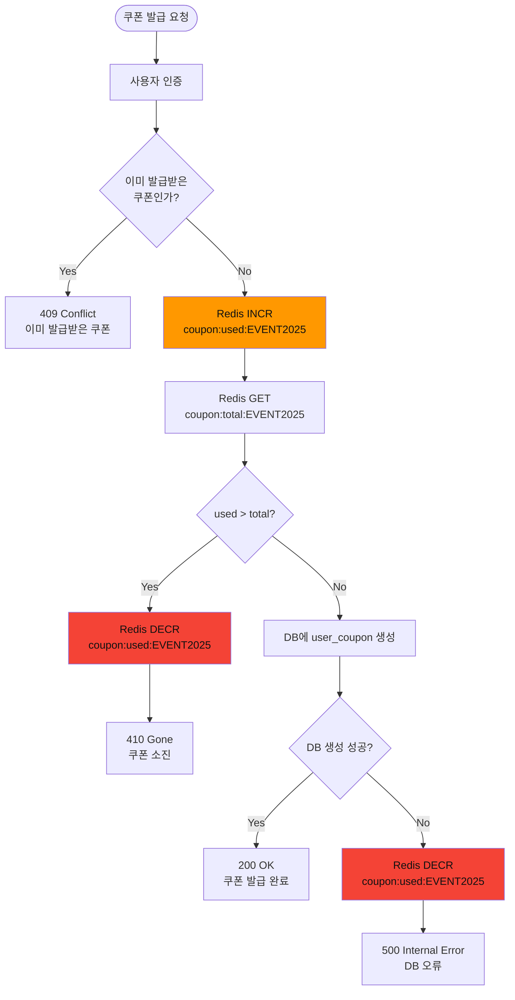
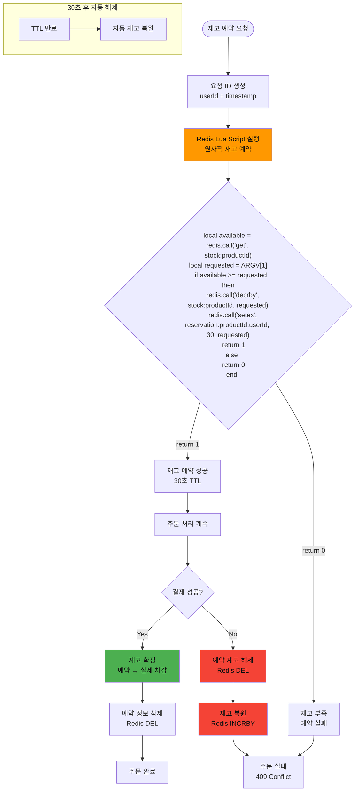
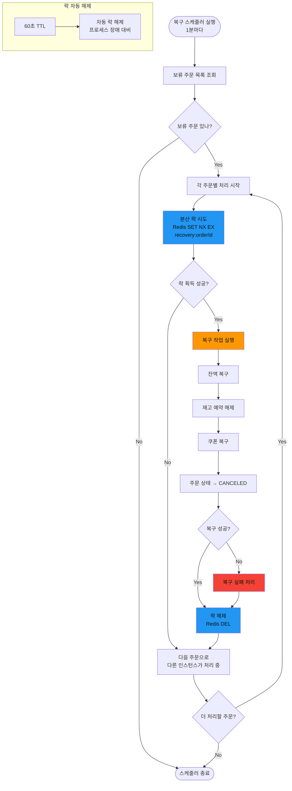
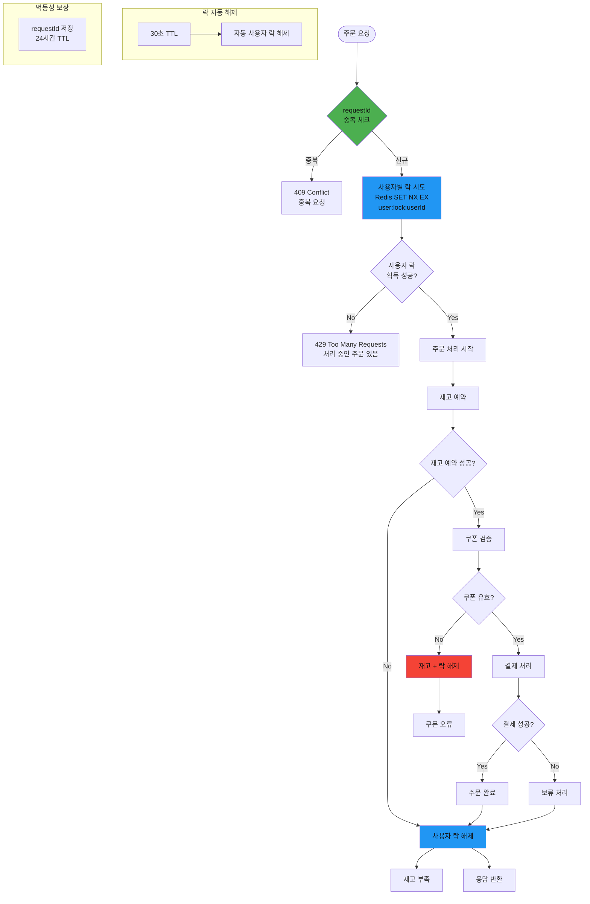

# 멀티 인스턴스 동시성 문제 및 해결방안

## 개요

멀티 인스턴스 환경에서 발생하는 주요 동시성 문제들과 락(Lock) 기반 해결방안을 정리합니다.

---

## 1. 선착순 쿠폰 발급 시 동시성 문제

### 문제 상황

선착순 쿠폰 발급 시 여러 인스턴스가 동시에 같은 쿠폰의 발급 가능 여부를 확인하고 발급하려고 시도하는 경우

### 해결 방안: Redis 원자적 연산 (INCR)



### 구현 예시

```typescript
async issueCoupon(userId: string, couponCode: string) {
  // 1. 중복 발급 체크
  const existingCoupon = await this.findUserCoupon(userId, couponCode);
  if (existingCoupon) {
    throw new ConflictException('이미 발급받은 쿠폰입니다');
  }

  // 2. 원자적 증가
  const usedCount = await this.redis.incr(`coupon:used:${couponCode}`);
  const totalCount = await this.redis.get(`coupon:total:${couponCode}`);

  // 3. 수량 초과 체크
  if (usedCount > parseInt(totalCount)) {
    await this.redis.decr(`coupon:used:${couponCode}`);
    throw new GoneException('쿠폰이 모두 소진되었습니다');
  }

  try {
    // 4. DB에 사용자 쿠폰 생성
    return await this.createUserCoupon(userId, couponCode);
  } catch (error) {
    // 5. DB 실패 시 보상 트랜잭션
    await this.redis.decr(`coupon:used:${couponCode}`);
    throw error;
  }
}
```

---

## 2. 재고 임시 예약 시 동시성 문제

### 문제 상황

재고 1개가 남은 상황에서 여러 인스턴스가 동시에 재고 예약을 시도하는 경우

### 해결 방안: Redis Lua Script를 활용한 원자적 예약



### 구현 예시

```typescript
async reserveStock(productId: string, quantity: number, userId: string) {
  const luaScript = `
    local stockKey = KEYS[1]
    local reservationKey = KEYS[2]
    local requested = tonumber(ARGV[1])

    local available = tonumber(redis.call('get', stockKey) or 0)

    if available >= requested then
      redis.call('decrby', stockKey, requested)
      redis.call('setex', reservationKey, 30, requested)
      return 1
    else
      return 0
    end
  `;

  const result = await this.redis.eval(
    luaScript,
    2,
    `stock:${productId}`,
    `reservation:${productId}:${userId}`,
    quantity
  );

  return result === 1;
}

async confirmStock(productId: string, userId: string) {
  // 예약 정보 삭제 (이미 재고는 차감됨)
  await this.redis.del(`reservation:${productId}:${userId}`);
}

async releaseStockReservation(productId: string, userId: string) {
  const reservedQuantity = await this.redis.get(`reservation:${productId}:${userId}`);
  if (reservedQuantity) {
    // 재고 복원
    await this.redis.incrby(`stock:${productId}`, parseInt(reservedQuantity));
    // 예약 정보 삭제
    await this.redis.del(`reservation:${productId}:${userId}`);
  }
}
```

---

## 3. 배치 작업 중복 실행 문제

### 문제 상황

여러 인스턴스에서 동시에 같은 보류 주문을 복구하려고 시도하는 경우

### 해결 방안: Redis 분산 락 (SET NX EX)



### 구현 예시

```typescript
@Cron('*/1 * * * *')
async recoverPendingOrders() {
  const pendingOrders = await this.orderRepository.findPendingOrders();

  for (const order of pendingOrders) {
    const lockKey = `recovery:${order.id}`;

    // 분산 락 획득 시도 (60초 TTL)
    const lockAcquired = await this.redis.set(
      lockKey,
      'locked',
      'PX', 60000,
      'NX'
    );

    if (lockAcquired === 'OK') {
      try {
        await this.recoverSingleOrder(order);
        this.logger.log(`Order ${order.id} recovered successfully`);
      } catch (error) {
        this.logger.error(`Failed to recover order ${order.id}`, error);
      } finally {
        // 락 해제
        await this.redis.del(lockKey);
      }
    } else {
      this.logger.debug(`Order ${order.id} is being recovered by another instance`);
    }
  }
}

private async recoverSingleOrder(order: Order) {
  // 1. 잔액 복구
  await this.walletService.restoreBalance(order.userId, order.finalAmount);

  // 2. 재고 예약 해제
  for (const item of order.items) {
    await this.productService.releaseStockReservation(item.productId, order.userId);
  }

  // 3. 쿠폰 복구
  if (order.usedCouponId) {
    await this.couponService.restoreCoupon(order.userId, order.usedCouponId);
  }

  // 4. 주문 상태 업데이트
  await this.orderRepository.updateStatus(order.id, OrderStatus.CANCELED);
}
```

---

## 4. 중복 요청 방지 문제

### 문제 상황

같은 사용자가 여러 탭에서 동시에 주문을 시도하는 경우

### 해결 방안: 사용자별 분산 락 + 요청 ID 멱등성



### 구현 예시

```typescript
async createOrder(userId: string, orderRequest: CreateOrderDto) {
  // 1. 요청 ID 중복 체크 (멱등성)
  const requestId = orderRequest.requestId;
  const existingRequest = await this.redis.get(`request:${requestId}`);
  if (existingRequest) {
    throw new ConflictException('중복된 요청입니다');
  }

  // 2. 사용자별 분산 락 획득
  const userLockKey = `user:lock:${userId}`;
  const lockAcquired = await this.redis.set(
    userLockKey,
    'processing',
    'PX', 30000,
    'NX'
  );

  if (lockAcquired !== 'OK') {
    throw new TooManyRequestsException('처리 중인 주문이 있습니다');
  }

  try {
    // 3. 요청 ID 저장 (24시간 TTL)
    await this.redis.setex(`request:${requestId}`, 86400, 'processed');

    // 4. 주문 처리
    const order = await this.processOrderLogic(userId, orderRequest);

    return order;
  } catch (error) {
    // 에러 발생 시 요청 ID 삭제 (재시도 가능하도록)
    await this.redis.del(`request:${requestId}`);
    throw error;
  } finally {
    // 5. 사용자 락 해제
    await this.redis.del(userLockKey);
  }
}

private async processOrderLogic(userId: string, orderRequest: CreateOrderDto) {
  // 재고 예약
  const stockReserved = await this.productService.reserveStock(
    orderRequest.productId,
    orderRequest.quantity,
    userId
  );

  if (!stockReserved) {
    throw new ConflictException('재고가 부족합니다');
  }

  try {
    // 쿠폰 검증, 결제 처리 등...
    return await this.completeOrder(userId, orderRequest);
  } catch (error) {
    // 실패 시 재고 예약 해제
    await this.productService.releaseStockReservation(
      orderRequest.productId,
      userId
    );
    throw error;
  }
}
```

---

## 동시성 제어 패턴 비교

| 패턴                    | 사용 사례            | 장점                    | 단점                   |
| ----------------------- | -------------------- | ----------------------- | ---------------------- |
| **Redis 원자적 연산**   | 쿠폰 발급, 카운터    | 빠름, 간단              | 복잡한 로직 불가       |
| **Redis Lua Script**    | 재고 예약            | 복잡한 원자적 연산 가능 | 스크립트 관리 필요     |
| **분산 락 (SET NX EX)** | 배치 작업, 중복 방지 | 다양한 상황 적용 가능   | 데드락 위험, 성능 저하 |
| **멱등성 키**           | 중복 요청 방지       | 네트워크 장애 대응      | 추가 저장소 필요       |

---

## 성능 고려사항

### Redis 연결 관리

```typescript
// 연결 풀 설정
const redisConfig = {
  host: "redis-cluster",
  port: 6379,
  maxRetriesPerRequest: 3,
  retryDelayOnFailover: 100,
  enableOfflineQueue: false,
  lazyConnect: true,
  maxLoadingTimeout: 5000,
};
```

### 락 타임아웃 설정

- **사용자 락**: 30초 (주문 처리 시간 고려)
- **복구 락**: 60초 (복구 작업 시간 고려)
- **재고 예약**: 30초 (결제 처리 시간 고려)

### 모니터링 지표

- 락 획득 실패율
- 락 보유 시간
- 동시성 충돌 빈도
- Redis 응답 시간

---

## 장애 대응 시나리오

### Redis 장애 시

1. **Graceful Degradation**: 락 없이 동작하되 동시성 이슈 경고
2. **Fallback to DB**: 데이터베이스 락 사용
3. **Circuit Breaker**: Redis 장애 감지 시 요청 제한

### 데드락 방지

1. **Lock Ordering**: 항상 동일한 순서로 락 획득
2. **Timeout 설정**: 모든 락에 TTL 설정
3. **Health Check**: 락 상태 주기적 모니터링

이 문서는 멀티 인스턴스 환경에서 발생하는 주요 동시성 문제들에 대한 실용적인 해결방안을 제시합니다.
