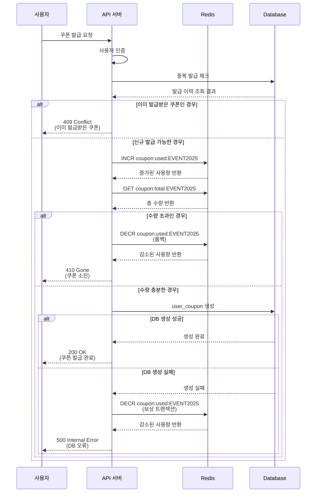
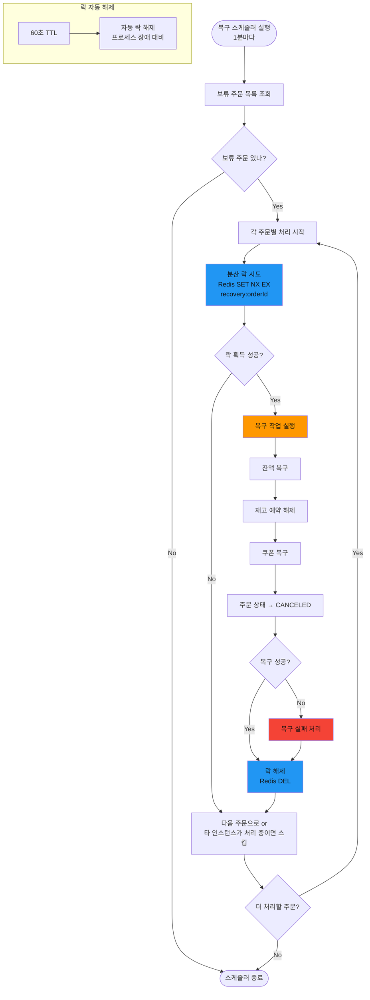
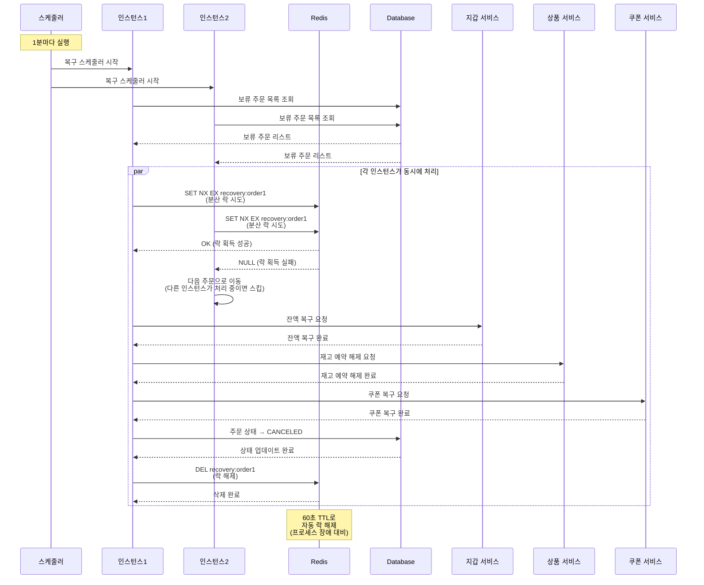
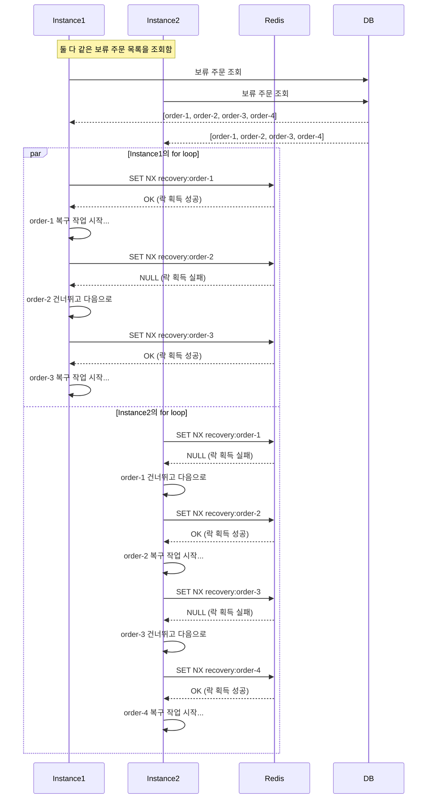

# 멀티 인스턴스 동시성 문제 및 해결방안

## 개요

멀티 인스턴스 환경에서 발생하는 주요 동시성 문제들과 락(Lock) 기반 해결방안을 정리합니다.

---

## 1. 선착순 쿠폰 발급 시 동시성 문제

### 문제 상황

선착순 쿠폰 발급 시 여러 인스턴스가 동시에 같은 쿠폰의 발급 가능 여부를 확인하고 발급하려고 시도하는 경우

### 해결 방안: Redis 원자적 연산 (INCR)

#### 플로우차트


#### 시퀀스 다이어그램



### 구현 예시

```typescript
async issueCoupon(userId: string, couponCode: string) {
  // 1. 중복 발급 체크
  const existingCoupon = await this.findUserCoupon(userId, couponCode);
  if (existingCoupon) {
    throw new ConflictException('이미 발급받은 쿠폰입니다');
  }

  // 2. 원자적 증가
  const usedCount = await this.redis.incr(`coupon:used:${couponCode}`);
  const totalCount = await this.redis.get(`coupon:total:${couponCode}`);

  // 3. 수량 초과 체크
  if (usedCount > parseInt(totalCount)) {
    await this.redis.decr(`coupon:used:${couponCode}`);
    throw new GoneException('쿠폰이 모두 소진되었습니다');
  }

  try {
    // 4. DB에 사용자 쿠폰 생성
    return await this.createUserCoupon(userId, couponCode);
  } catch (error) {
    // 5. DB 실패 시 보상 트랜잭션
    await this.redis.decr(`coupon:used:${couponCode}`);
    throw error;
  }
}
```

---

## 2. 배치 작업 중복 실행 문제

### 문제 상황

여러 인스턴스에서 동시에 같은 보류 주문을 복구하려고 시도하는 경우

### 해결 방안: Redis 분산 락 (SET NX EX)

#### 2-1. 플로우차트



#### 2-2. 시퀀스 다이어그램



#### 2-3. 시퀀스 다이어그램 2



### 구현 예시

```typescript
@Cron('*/1 * * * *')
async recoverPendingOrders() {
  const pendingOrders = await this.orderRepository.findPendingOrders();

  for (const order of pendingOrders) {
    const lockKey = `recovery:${order.id}`;

    // 분산 락 획득 시도 (60초 TTL)
    const lockAcquired = await this.redis.set(
      lockKey,
      'locked',
      'PX', 60000,
      'NX'
    );

    if (lockAcquired === 'OK') {
      try {
        await this.recoverSingleOrder(order);
        this.logger.log(`Order ${order.id} recovered successfully`);
      } catch (error) {
        this.logger.error(`Failed to recover order ${order.id}`, error);
      } finally {
        // 락 해제
        await this.redis.del(lockKey);
      }
    } else {
      this.logger.debug(`Order ${order.id} is being recovered by another instance`);
    }
  }
}

private async recoverSingleOrder(order: Order) {
  // 1. 잔액 복구
  await this.walletService.restoreBalance(order.userId, order.finalAmount);

  // 2. 재고 예약 해제
  for (const item of order.items) {
    await this.productService.releaseStockReservation(item.productId, order.userId);
  }

  // 3. 쿠폰 복구
  if (order.usedCouponId) {
    await this.couponService.restoreCoupon(order.userId, order.usedCouponId);
  }

  // 4. 주문 상태 업데이트
  await this.orderRepository.updateStatus(order.id, OrderStatus.CANCELED);
}
```
