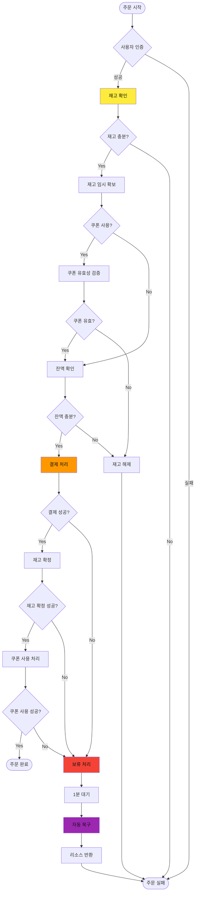

# 📋 이커머스 상품 주문 시스템 기술 명세서

## 1. 시스템 개요

### 1.1 목적

디지털 상품 주문 및 결제 시스템으로, 사용자 잔액과 쿠폰을 활용한 안전한 거래 처리를 제공합니다.

### 1.2 주요 기능

- 사용자 잔액 충전 및 관리
- 디지털 상품 주문 및 결제
- 선착순 쿠폰 발급 및 사용
- 재고 관리 및 동시성 제어
- 실패 상황 자동 복구
- 인기 상품 통계 및 추천

## 2. 시스템 아키텍처

### 2.1 전체 구조

```mermaid
graph TB
    subgraph "Load Balancer"
        LB[Load Balancer]
    end

    subgraph "Application Instances"
        I1[Instance 1]
        I2[Instance 2]
        I3[Instance 3]
    end

    subgraph "Shared Resources"
        DB[(PostgreSQL)]
        R[(Redis)]
        K[(Kafka)]
    end

    subgraph "Critical Sections"
        CS1[재고 관리]
        CS2[쿠폰 발급]
        CS3[배치 작업]
    end

    LB --> I1
    LB --> I2
    LB --> I3

    I1 --> DB
    I2 --> DB
    I3 --> DB

    I1 --> R
    I2 --> R
    I3 --> R

    I1 --> K
    I2 --> K
    I3 --> K

    I1 -.-> CS1
    I2 -.-> CS1
    I3 -.-> CS1

    I1 -.-> CS2
    I2 -.-> CS2
    I3 -.-> CS2

    I1 -.-> CS3
    I2 -.-> CS3
    I3 -.-> CS3

    CS1 --> R
    CS2 --> R
    CS3 --> R

    style CS1 fill:#333
    style CS2 fill:#333
    style CS3 fill:#333
```



### 2.2 모듈 구조

```
src/
├── auth/           # JWT 인증 및 사용자 관리
├── user/           # 사용자 프로필 관리
├── product/        # 상품 조회 및 관리
├── order/          # 주문 처리 핵심 로직
├── wallet/         # 잔액 충전 및 결제
├── coupon/         # 쿠폰 발급 및 사용
├── stats/          # 인기 상품 통계
├── recovery/       # 실패 주문 복구
└── database/       # 데이터베이스 설정
```

## 3. 기술 스택

| 구분         | 기술         | 버전  | 목적                              |
| ------------ | ------------ | ----- | --------------------------------- |
| 런타임       | Node.js      | 18.x  | 서버 사이드 JavaScript 실행       |
| 프레임워크   | NestJS       | 10.x  | 엔터프라이즈급 Node.js 프레임워크 |
| 데이터베이스 | PostgreSQL   | 15.x  | 관계형 데이터 저장 및 트랜잭션    |
| 캐시         | Redis        | 7.x   | 세션, 재고 예약, 통계 캐싱        |
| 메시징       | Kafka (Mock) | -     | 주문 이벤트 로깅                  |
| ORM          | TypeORM      | 0.3.x | 데이터베이스 ORM                  |
| 인증         | JWT          | -     | 무상태 인증                       |

## 4. 핵심 비즈니스 플로우

### 4.1 주문 처리 플로우



### 4.2 동시성 제어 전략

#### 재고 관리

- **낙관적 락**: 재고 수량 업데이트 시 버전 체크
- **Redis 분산 락**: 동시 재고 예약 방지
- **임시 예약 시스템**: 30초 TTL로 재고 임시 확보

#### 잔액 관리

- **비관적 락**: 잔액 차감 시 행 단위 락
- **예약 잔액 분리**: 사용 가능 잔액과 예약 잔액 구분
- **원자적 트랜잭션**: 모든 잔액 변경은 단일 트랜잭션 내 처리

#### 쿠폰 관리

- **원자적 카운터**: 쿠폰 사용량 증가 시 원자적 연산
- **중복 방지**: (user_id, coupon_id) 유니크 제약

---

## 6. 성능 및 확장성

### 6.1 성능 지표

| 메트릭             | 목표값   | 측정 방법                |
| ------------------ | -------- | ------------------------ |
| 주문 처리 지연시간 | < 2초    | API 응답 시간 측정       |
| 동시 주문 처리량   | 1000 TPS | 부하 테스트              |
| 재고 충돌 실패율   | < 5%     | 동시 주문 시 실패 비율   |
| 자동 복구 성공률   | > 99%    | 보류 주문 복구 성공 비율 |

### 6.2 확장성 고려사항

#### 수평 확장 (Scale-out)

- **무상태 API**: JWT 토큰 기반 인증으로 세션 의존성 제거
- **데이터베이스 분할**: 사용자 기반 샤딩 고려
- **캐시 분산**: Redis Cluster 도입 가능
- **웹 서버 복제**: 오토 스케일링 로드 밸런서 도입 가능
