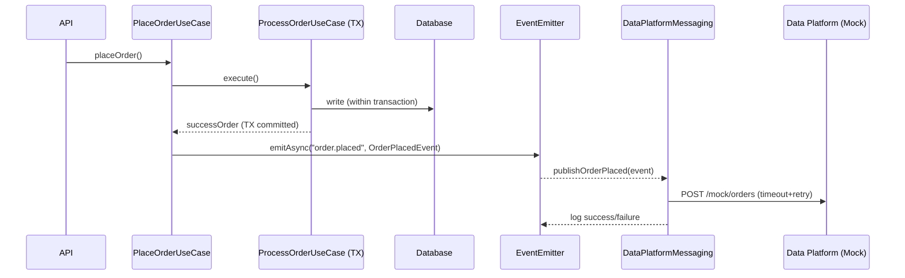
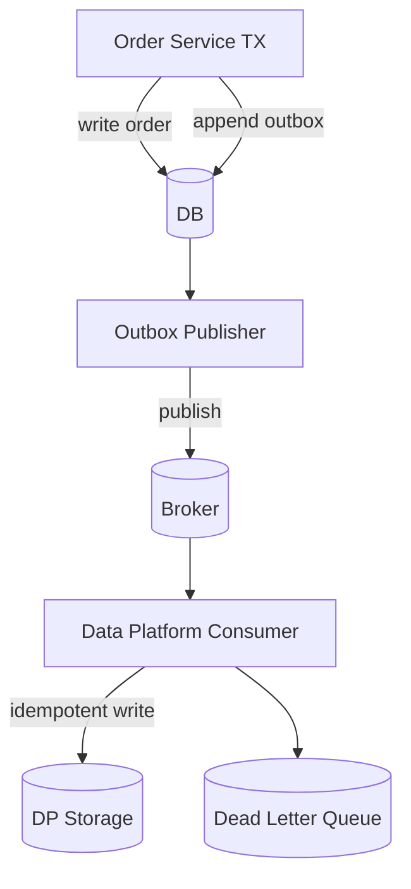

# 주문 이벤트 처리 설계

- 주문 이벤트 발송 시 어떻게 처리되는지 현재 구현과 앞으로 확장 가능한 방향성을 문서로 정리합니다.

## 현재 구현

- After-commit 이벤트 발행: `PlaceOrderUseCase`에서 주문 성공 후 `order.placed` 발행
- 비동기 핸들러: `DataPlatformMessaging`가 `@OnEvent("order.placed", { async: true })`로 수신
- HTTP 전송 안전장치: 타임아웃, 최대 3회 지수형 재시도, 로깅 추가

핵심 포인트: 이벤트 발행을 트랜잭션 밖으로 옮겨 "커밋 이후"에만 외부 전송이 실행됩니다. 외부 전송 실패 시에도 주문 성공은 유지됩니다.

### 코드 매핑

- 이벤트 발행: `src/order/application/use-cases/tier-4/place-order.user-case.ts`
- 이벤트 수신/전송: `src/order/infrastructure/messaging/data-platform.messaging.ts`
- 이벤트 페이로드: `src/order/infrastructure/messaging/events.ts`

### 장애/신뢰성 고려 사항

- 타임아웃: `MOCK_DATA_PLATFORM_TIMEOUT_MS` 기본 3000ms
- 재시도: 최대 3회, 지수 백오프(최대 4s)
- 로깅: 성공/실패/재시도 로그 기록
- 외부 전송 실패가 주문 트랜잭션에 영향을 주지 않음
- 현재는 중요한 로직으로서 작동하고 있지 않는 다는 가정하에 성공/실패/대기 상태 등을 db에 기록하지 않고 있습니다.

---

## 타 시나리오일 때는 어떻게 구현하죠?

### 만약 더 안정적인 재처리가 필요한 로직이라면?

- 비동기 처리는 유지.
- 실패시 로거 로그로만 남고 휘발되는 것이 아니라 DB에 남기고 싶다면 단일 서버에서는 성공 실패 대기등의 상태 컬럼 등을 두면됩니다.

### 단일 서버가 아니라 여러 개의 서버가 통신하는 구조이며 신뢰도 있게 이벤트 처리가 보장되어야한다면?

1. Outbox 패턴 도입 (주문 서비스)

- 주문 커밋과 함께 동일 DB에 `outbox_events` 레코드 저장
- 별도 퍼블리셔가 outbox를 폴링/스트림하여 브로커(Kafka/RabbitMQ)로 전송
- 전송 성공 시 outbox 상태 업데이트(또는 삭제)

2. 멱등성 + 선택적으로 Inbox (소비자/데이터 플랫폼)

- 소비 측에서 `idempotency_key` 기준으로 중복 수신 제거
- 처리 결과 저장하여 재전송에도 부작용 없이 무해
- inbox를 따로 구현할지는 선택임
  - 멱등성 보장은 키만으로도 할 수 있어서 꼭 inbox 패턴을 구현할 필요까지는 없을 수 있음.
  - 해당 이벤트가 지금 어느 지점까지 진행되었고 등의 상태를 저장 해야할 경우에는 inbox가 더 중요해짐.

3. 보상 트랜잭션/재처리

- 장애 시 재시도 정책 + DLQ + 운영 대시보드로 재처리

4. Circuit Breaker/Bulkhead

- 지금 retry 3번씩 하고 있는데 - 요청 자체가 많아지면 3번씩 계속 retry하는게 리소스상 안 좋을 수도 있음
- 외부 시스템 장애가 내부 리소스를 고갈시키지 않도록 서킷브레이커 구현 + 엔드포인트 별 동시 요청 제한

