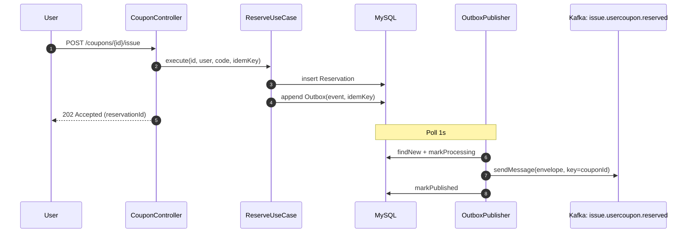
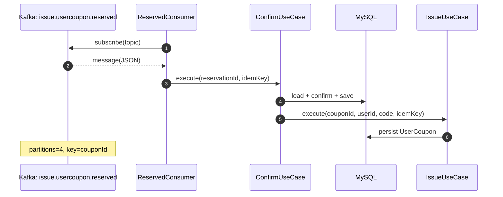

### 쿠폰 발급 Kafka 메시지 플로우

- 유저 경험: 쿠폰 예약 -> 폴링으로 예약 확정되었는지 확인 -> 확정 -> 프론트에서 성공 알림
- 이렇게 구성한 이유: 이벤트 kafka에서 줄서다가 처리되기까지 오래 걸릴 가능성이 있어서 프론트 입장에서 커넥션 빠르게 끊은 뒤에 폴링하는 것이 더 안정적인 설계라고 판단함.

## 쿠폰 예약

## 쿠폰 확정

- 키 포인트
  - **토픽**: `issue.usercoupon.reserved`
  - **파티션**: 4 (관리자 초기화 시 생성)
  - **파티셔닝 키**: `couponId` (주문/쿠폰 단위 순서 보장)
  - **메시지 포맷**: `{ eventId, eventType, timestamp, data, idempotencyKey }`
  - **전송 경로**: 예약 트랜잭션 → Outbox 레코드 → OutboxPublisher 폴링/퍼블리시 → Kafka → Consumer → 예약 확정/발급
