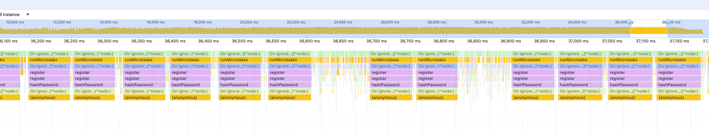
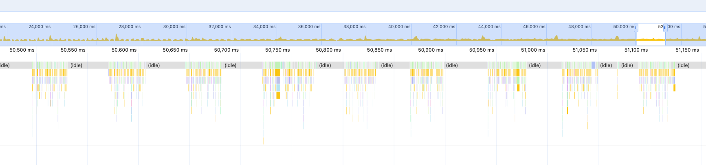

# 개선 사항 정리

`가입 => 충전 => 주문` 시나리오가 E2E RPS 12~14정도 밖에 안정적으로 버티지 못하여 개선점을 강구하였습니다.

## <1> 프로파일링 후 hashPassword 비동기 처리로 변경 => RPS 2배 향상





(두 스크린샷이 레코딩 시작을 다르게 해서 ms 는 다른데, 동일한 테스트의 마지막 부분 - 14rps 일때의 프로파일 상태입니다.)

hashPassword 함수가 동기 처리 함수를 쓰고 있어서 메인 스레드를 블로킹하고 있었습니다. 비동기 처리로 변경해주었습니다. 성능이 2배 정도 개선되었습니다.

- `가입 => 충전 => 주문` E2E 시나리오에서 RPS 28까지 안정적으로 처리할 수 있게 되었습니다.
  - 2분 동안 지속적으로 트래픽을 주었을 때 p95 응답시간이 80ms 수준
  - 2분만 테스트했는데 신뢰도가 있는 테스트인지?:
    - 매우 넉넉하게 rps를 테스트하면 항상 p95가 70~80ms가 나왔었습니다.
    - 그래서 high rps 환경에서도 1~2분만 돌려도 p95가 70~80ms일 때는 항상 안정적으로 동작하는 것으로 판단했습니다.
    - 반대로 이 수치를 넘어서면 시스템이 버티지 못한다고 간주했습니다. 2분간은 200ms이더라도 10분지나면 점점 부하가 더 걸려서 악화될 것이라고 생각했습니다.
    - 매번 10분 돌리기는 힘들어서 이런 식으로 짧게 테스트하고 70~80ms 선에 있는지만 확인했습니다.

## <2> 슬로우 쿼리 확인 - 개선 없음

```shell
## 슬로우 쿼리 활성화
docker exec -it hh-week-2-mysql mysql -uroot -proot -e "SET GLOBAL slow_query_log=ON; SET GLOBAL long_query_time=0.05; SET GLOBAL log_output='TABLE';"

## 최근 슬로우 쿼리 조회
docker exec -it hh-week-2-mysql mysql --binary-as-hex=false -uroot -proot -e "SELECT start_time, query_time, rows_examined, db, CONVERT(sql_text USING utf8mb4) AS sql_text FROM mysql.slow_log ORDER BY start_time DESC LIMIT 10\G" | cat
```

데이터 수집은 300초 동안 80rps

```ts
{ duration: "300s", target: 80 }
```

1000개를 limit으로 걸고 뽑았을 때 상위에 포진하는 모든 slow 쿼리 타입은 단 두 가지 종류였습니다:

```shell
## 1위
sql_text: SELECT `p`.`id` AS `p_id`, `p`.`name` AS `p_name`, `p`.`description` AS `p_description`, `p`.`price` AS `p_price`, `p`.`total_stock` AS `p_total_stock`, `p`.`reserved_stock` AS `p_reserved_stock`, `p`.`is_active` AS `p_is_active`, `p`.`created_at` AS `p_created_at`, `p`.`updated_at` AS `p_updated_at` FROM `products` `p` WHERE `p`.`id` = (SELECT sr.product_id FROM stock_reservations sr WHERE sr.id = '39c1dc8e-0ae0-4b1d-b5e3-79b17acc10cd') FOR UPDATE

## 2위
sql_text: SELECT `ProductTypeOrmEntity`.`id` AS `ProductTypeOrmEntity_id`, `ProductTypeOrmEntity`.`name` AS `ProductTypeOrmEntity_name`, `ProductTypeOrmEntity`.`description` AS `ProductTypeOrmEntity_description`, `ProductTypeOrmEntity`.`price` AS `ProductTypeOrmEntity_price`, `ProductTypeOrmEntity`.`total_stock` AS `ProductTypeOrmEntity_total_stock`, `ProductTypeOrmEntity`.`reserved_stock` AS `ProductTypeOrmEntity_reserved_stock`, `ProductTypeOrmEntity`.`is_active` AS `ProductTypeOrmEntity_is_active`, `ProductTypeOrmEntity`.`created_at` AS `ProductTypeOrmEntity_created_at`, `ProductTypeOrmEntity`.`updated_at` AS `ProductTypeOrmEntity_updated_at` FROM `products` `ProductTypeOrmEntity` WHERE ((`ProductTypeOrmEntity`.`id` = 'cache-test-product-1')) LIMIT 1 FOR UPDATE
```

두 쿼리의 출처는 `product.repository.ts`

```ts
  // 위에서 첫 번째 쿼리
  async findByStockReservationId(
    stockReservationId: string
  ): Promise<Product | null> {
    const entity = await this.productRepository
      .createQueryBuilder("p")
      .where(
        "p.id = (SELECT sr.product_id FROM stock_reservations sr WHERE sr.id = :rid)",
        { rid: stockReservationId }
      )
      .setLock("pessimistic_write")
      .getOne();
    return entity ? this.toDomain(entity) : null;
  }

  // 위에서 두 번째 쿼리
  async findByIdWithLock(id: string): Promise<Product | null> {
    const entity = await this.productRepository.findOne({
      where: { id },
      lock: { mode: "pessimistic_write" },
    });
    return entity ? this.toDomain(entity) : null;
  }
```

각각 순서대로 confirm-stock, reserve-stock 유스케이스에서 사용됩니다.

이거는 코드를 뜯어봤는데, 1달전에 데드락 방지를 위해 모두 락 순서 통일하다가 쿼리가 느려질 수 밖에 없던 상황이 존재했었습니다.

현재 락 잡는 순서는 프로덕트 => 재고 예약 순입니다. 이걸 위해서 락이 조금은 더 비효율적으로 구성되어있습니다. (1번 케이스)

1, 2번 케이스 모두 근본적인 원인 해결을 위해서는 프로젝트 전체적인 DA가 다시 필요해서 시간이 오래걸릴 것 같았습니다. 그래서 여기까지 진행했습니다.

## <3> 커넥션 풀 조정 - 개선 없음

커넥션 풀은 cpu 코어 사용에 민감하기에 docker desktop 확인해본 결과 CPU Limit은 12개로 책정중이었습니다.
이는 제 맥북 전체 코어 갯수랑 동일합니다. 어차피 지금 컴퓨터 CPU 점유율은 제로에 가깝기 때문에 객관성이 많이 떨어지진 않을듯하다고 판단했습니다.
실제로 돌려봤을 때 점유율 60% 대를 넘은 적은 없어서 CPU 연산 병목은 없는 상태에서 연산이 진행되고 있었습니다.

- 이제 비교가 쉽도록 초당 요청 수치를 바꾸어주었습니다. (무조건 병목이 생기도록 강제)
- 맥북 cpu 상태에 자꾸 영향을 받아서 6 => 10 => 16 => 20 => 6 => 10 => 16 => ... 과 같은 순서로 3번 사이클 돌렸습니다 (시간대에 따른 차이 최소화)

```js
{ duration: "60s", target: 80 },
```

테스트 결과 요약:

- 3회씩 해보았을 때 6, 10, 16, 20, 모두 다 동일한 응답 수준이었습니다. (p95기준)
- 이유를 고민해보았는데, 사실 지금 현재 DB가 병목이 아니라서 DB는 꽤 놀고 있는 듯했습니다. 그렇기에 커넥션 풀을 아무리 바꾸어도 개선은 없는 것이었습니다.
- 커넥션 풀에 따른 병목은 지금 RPS를 개선하기에는 영향이 없다고 판단했습니다.

<details>
<summary>
테스트 결과 상세보기 펼치기
</summary>
connectionLimit 6인 경우 3회:

```
█ THRESHOLDS

  http_req_duration
  ✓ 'p(95)<800' p(95)=289.66ms

  http_req_failed
  ✓ 'rate<0.02' rate=0.00%

  order_success
  ✓ 'rate>0.98' rate=100.00%

█ THRESHOLDS

  http_req_duration
  ✓ 'p(95)<800' p(95)=720.19ms

  http_req_failed
  ✓ 'rate<0.02' rate=0.00%

  order_success
  ✓ 'rate>0.98' rate=100.00%

█ THRESHOLDS

  http_req_duration
  ✓ 'p(95)<800' p(95)=274.3ms

  http_req_failed
  ✓ 'rate<0.02' rate=0.00%

  order_success
  ✓ 'rate>0.98' rate=100.00%
```

connectionLimit 10인 경우 3회:

```
█ THRESHOLDS

  http_req_duration
  ✓ 'p(95)<800' p(95)=282.48ms

  http_req_failed
  ✓ 'rate<0.02' rate=0.00%

  order_success
  ✓ 'rate>0.98' rate=100.00%

█ THRESHOLDS

  http_req_duration
  ✓ 'p(95)<800' p(95)=341.99ms

  http_req_failed
  ✓ 'rate<0.02' rate=0.00%

  order_success
  ✓ 'rate>0.98' rate=100.00%

█ THRESHOLDS

  http_req_duration
  ✓ 'p(95)<800' p(95)=266.52ms

  http_req_failed
  ✓ 'rate<0.02' rate=0.00%

  order_success
  ✓ 'rate>0.98' rate=100.00%
```

connectionLimit 16인 경우 3회:

```
█ THRESHOLDS

  http_req_duration
  ✓ 'p(95)<800' p(95)=315.21ms

  http_req_failed
  ✓ 'rate<0.02' rate=0.00%

  order_success
  ✓ 'rate>0.98' rate=100.00%


█ THRESHOLDS

  http_req_duration
  ✓ 'p(95)<800' p(95)=335.8ms

  http_req_failed
  ✓ 'rate<0.02' rate=0.00%

  order_success
  ✓ 'rate>0.98' rate=100.00%

█ THRESHOLDS

  http_req_duration
  ✓ 'p(95)<800' p(95)=248.69ms

  http_req_failed
  ✓ 'rate<0.02' rate=0.00%

  order_success
  ✓ 'rate>0.98' rate=100.00%
```

connectionLimit 20인 경우 3회:

```
█ THRESHOLDS

  http_req_duration
  ✓ 'p(95)<800' p(95)=324.75ms

  http_req_failed
  ✓ 'rate<0.02' rate=0.00%

  order_success
  ✓ 'rate>0.98' rate=100.00%

█ THRESHOLDS

  http_req_duration
  ✓ 'p(95)<800' p(95)=254.49ms

  http_req_failed
  ✓ 'rate<0.02' rate=0.00%

  order_success
  ✓ 'rate>0.98' rate=100.00%

█ THRESHOLDS

  http_req_duration
  ✓ 'p(95)<800' p(95)=298.14ms

  http_req_failed
  ✓ 'rate<0.02' rate=0.00%

  order_success
  ✓ 'rate>0.98' rate=100.00%
```

</details>

## <4> 추가 진행 가능한 부분

시간이 부족하여 여기까지 진행했습니다.

추가로 진행 가능하다고 생각하는 부분은:

- 각 쿼리별로 모두 응답 시간 통계 뽑아보고 병목 분석
  - 인덱스 최적화 진행
  - 쿼리 최적화 진행
- 모든 쿼리와 유스케이스 정리 후 최적 락 획득 순서 재정립.
- 웹 서버를 여러대로 스케일링 했을 때 DB 슬로우 쿼리와 최적 커넥션 풀 확인
