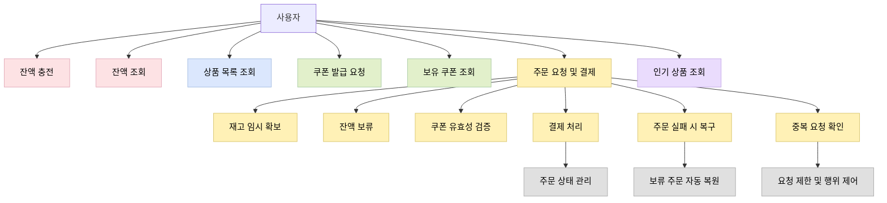

## 유스케이스 다이어그램

```mermaid
graph TB

U[사용자]

%% 기본 기능
A1[잔액 충전]
A2[잔액 조회]
B1[상품 목록 조회]
C1[쿠폰 발급 요청]
C2[보유 쿠폰 조회]
D1[주문 요청 및 결제]
E1[인기 상품 조회]

%% 세부 처리
D2[재고 임시 확보]
D3[잔액 보류]
D4[쿠폰 유효성 검증]
D5[결제 처리]
D6[주문 실패 시 복구]
D7[중복 요청 확인]

%% 시스템 내부
S1[주문 상태 관리]
S2[보류 주문 자동 복원]
S3[요청 제한 및 행위 제어]

%% 관계
U --> A1
U --> A2
U --> B1
U --> C1
U --> C2
U --> D1
U --> E1

D1 --> D2
D1 --> D3
D1 --> D4
D1 --> D5
D1 --> D6
D1 --> D7

D6 --> S2
D5 --> S1
D7 --> S3

%% 스타일 - 파스텔톤 + 검정 텍스트
classDef balance fill:#FDE2E4,color:#000,stroke:#E2A9B8;
classDef product fill:#DBE7FD,color:#000,stroke:#A3BDE3;
classDef coupon fill:#E2F0CB,color:#000,stroke:#A9CBA2;
classDef order fill:#FFF1B6,color:#000,stroke:#D9C56E;
classDef stats fill:#EADCFD,color:#000,stroke:#C4A7E7;
classDef internal fill:#E0E0E0,color:#000,stroke:#AAAAAA;

class A1,A2 balance;
class B1 product;
class C1,C2 coupon;
class D1,D2,D3,D4,D5,D6,D7 order;
class E1 stats;
class S1,S2,S3 internal;

```
