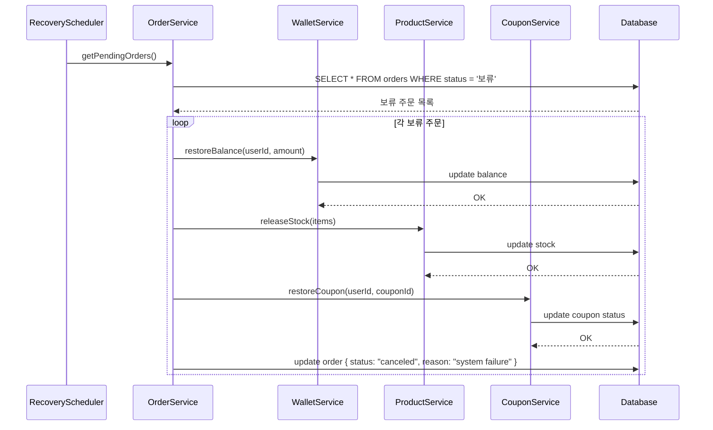
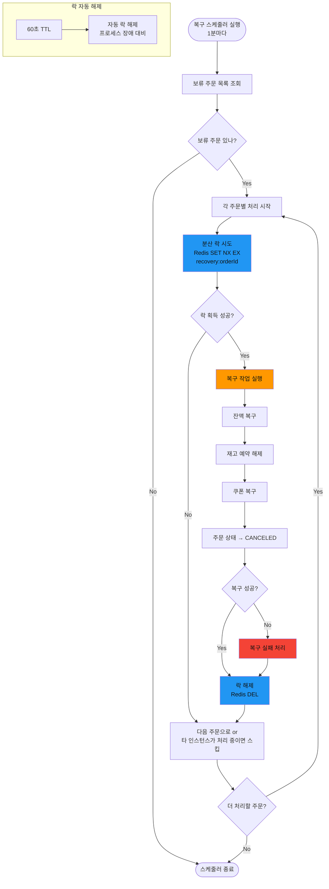
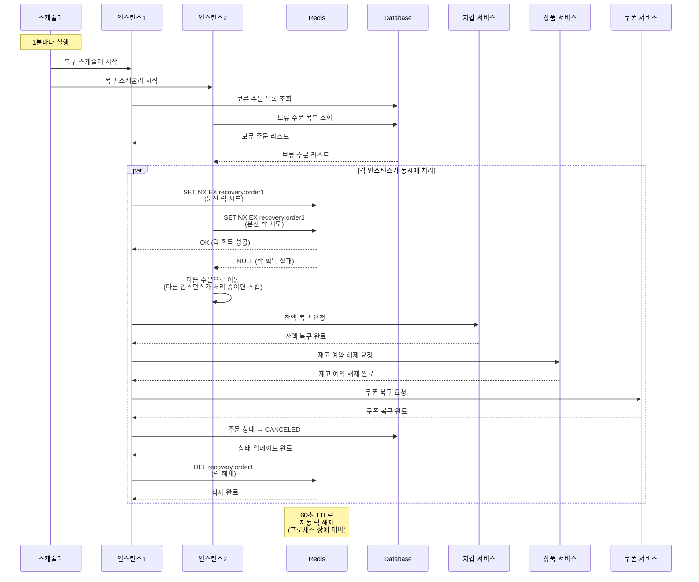
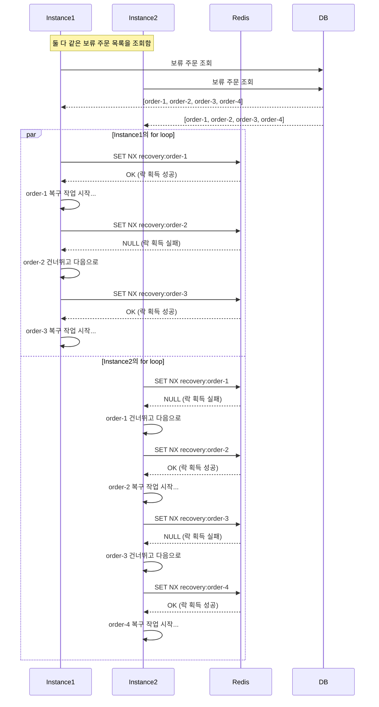

# 보류 주문 → 자동 복구 흐름

## 5-1. 주문 보류 → 타이머 만료 → 자동 복구



---

## 동시성 문제 해결방안

### 배치 작업 중복 실행 문제

#### 문제 상황

여러 인스턴스에서 동시에 같은 보류 주문을 복구하려고 시도하는 경우

#### 해결 방안: Redis 분산 락 (SET NX EX)

##### 플로우차트



##### 시퀀스 다이어그램 - 2개의 인스턴스 동시 요청 집중 탐색



##### 시퀀스 다이어그램 2 - 2개의 인스턴스 여러 요청 loop 처리 집중 시각화



#### 구현 예시

```typescript
@Cron('*/1 * * * *')
async recoverPendingOrders() {
  const pendingOrders = await this.orderRepository.findPendingOrders();

  for (const order of pendingOrders) {
    const lockKey = `recovery:${order.id}`;

    // 분산 락 획득 시도 (60초 TTL)
    const lockAcquired = await this.redis.set(
      lockKey,
      'locked',
      'PX', 60000,
      'NX'
    );

    if (lockAcquired === 'OK') {
      try {
        await this.recoverSingleOrder(order);
        this.logger.log(`Order ${order.id} recovered successfully`);
      } catch (error) {
        this.logger.error(`Failed to recover order ${order.id}`, error);
      } finally {
        // 락 해제
        await this.redis.del(lockKey);
      }
    } else {
      this.logger.debug(`Order ${order.id} is being recovered by another instance`);
    }
  }
}

private async recoverSingleOrder(order: Order) {
  // 1. 잔액 복구
  await this.walletService.restoreBalance(order.userId, order.finalAmount);

  // 2. 재고 예약 해제
  for (const item of order.items) {
    await this.productService.releaseStockReservation(item.productId, order.userId);
  }

  // 3. 쿠폰 복구
  if (order.usedCouponId) {
    await this.couponService.restoreCoupon(order.userId, order.usedCouponId);
  }

  // 4. 주문 상태 업데이트
  await this.orderRepository.updateStatus(order.id, OrderStatus.CANCELED);
}
```
