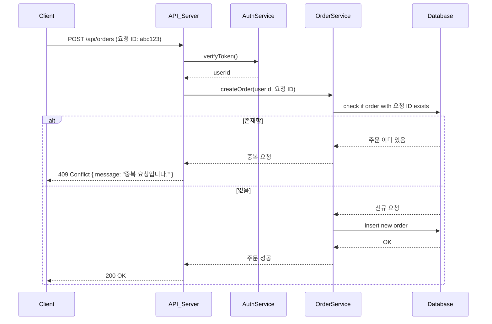

# 중복 결제 요청 방지

## 6-1. 같은 주문 재요청 시 중복 방지 응답

엔드포인트: `POST /api/orders`

```mermaid
sequenceDiagram
    participant Client
    participant API_Server
    participant AuthService
    participant OrderService
    participant Database

    Client->>API_Server: POST /api/orders (요청 ID: abc123)
    API_Server->>AuthService: verifyToken()
    AuthService-->>API_Server: userId

    API_Server->>OrderService: createOrder(userId, 요청 ID)

    OrderService->>Database: check if order with 요청 ID exists
    alt 존재함
        Database-->>OrderService: 주문 이미 있음
        OrderService-->>API_Server: 중복 요청
        API_Server-->>Client: 409 Conflict { message: "중복 요청입니다." }
    else 없음
        Database-->>OrderService: 신규 요청
        OrderService->>Database: insert new order
        Database-->>OrderService: OK
        OrderService-->>API_Server: 주문 성공
        API_Server-->>Client: 200 OK
    end
```

### 구현 방안

- 요청 ID 또는 타임스탬프 기반 비교
- 응답: "이미 처리 중입니다"
- 멱등성 보장을 위한 요청 ID 관리
