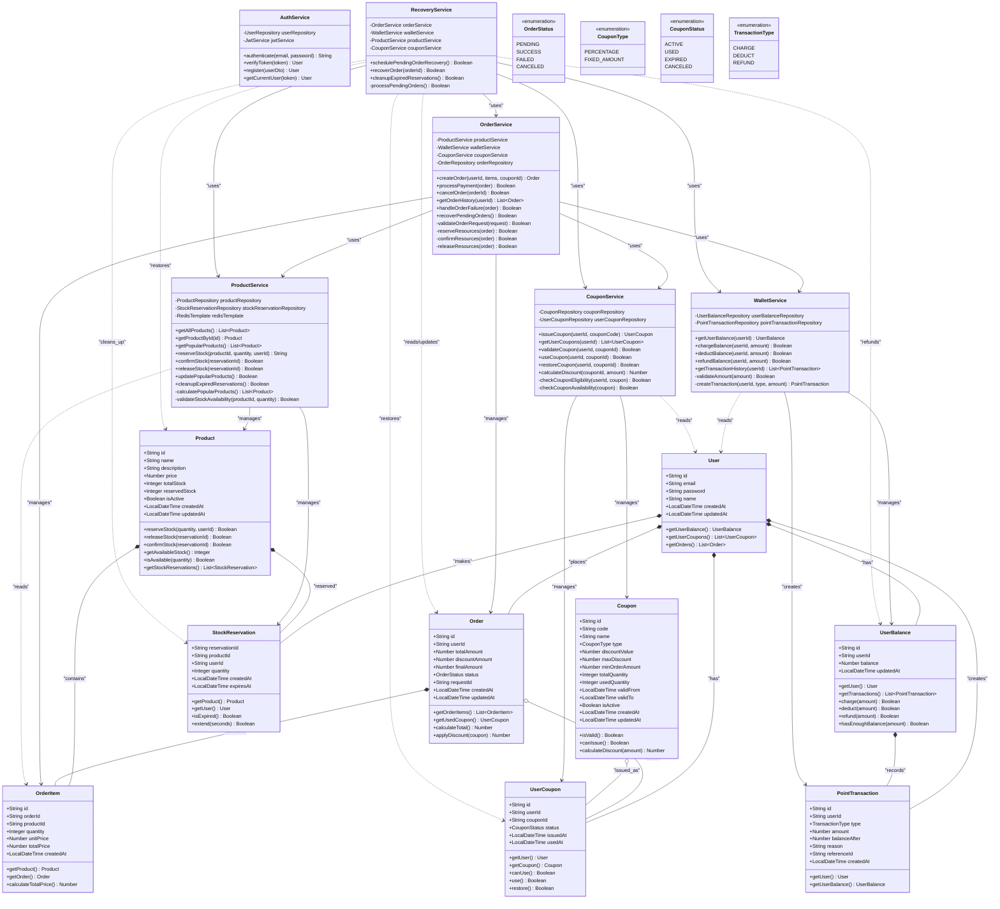

# 클래스 다이어그램

## 전체 시스템 클래스 다이어그램

```mermaid
classDiagram
    %% 엔티티 클래스
    class User {
        +String id
        +String email
        +String password
        +String name
        +LocalDateTime createdAt
        +LocalDateTime updatedAt
        +getUserBalance() UserBalance
        +getUserCoupons() List~UserCoupon~
        +getOrders() List~Order~
    }

    class Product {
        +String id
        +String name
        +String description
        +Number price
        +Integer totalStock
        +Integer reservedStock
        +Boolean isActive
        +LocalDateTime createdAt
        +LocalDateTime updatedAt
        +reserveStock(quantity, userId) Boolean
        +releaseStock(reservationId) Boolean
        +confirmStock(reservationId) Boolean
        +getAvailableStock() Integer
        +isAvailable(quantity) Boolean
        +getStockReservations() List~StockReservation~
    }

    class Order {
        +String id
        +String userId
        +Number totalAmount
        +Number discountAmount
        +Number finalAmount
        +OrderStatus status
        +String requestId
        +LocalDateTime createdAt
        +LocalDateTime updatedAt
        +getOrderItems() List~OrderItem~
        +getUsedCoupon() UserCoupon
        +calculateTotal() Number
        +applyDiscount(coupon) Number
    }

    class OrderItem {
        +String id
        +String orderId
        +String productId
        +Integer quantity
        +Number unitPrice
        +Number totalPrice
        +LocalDateTime createdAt
        +getProduct() Product
        +getOrder() Order
        +calculateTotalPrice() Number
    }

    class Coupon {
        +String id
        +String code
        +String name
        +CouponType type
        +Number discountValue
        +Number maxDiscount
        +Number minOrderAmount
        +Integer totalQuantity
        +Integer usedQuantity
        +LocalDateTime validFrom
        +LocalDateTime validTo
        +Boolean isActive
        +LocalDateTime createdAt
        +LocalDateTime updatedAt
        +isValid() Boolean
        +canIssue() Boolean
        +calculateDiscount(amount) Number
    }

    class UserCoupon {
        +String id
        +String userId
        +String couponId
        +CouponStatus status
        +LocalDateTime issuedAt
        +LocalDateTime usedAt
        +getUser() User
        +getCoupon() Coupon
        +canUse() Boolean
        +use() Boolean
        +restore() Boolean
    }

    class UserBalance {
        +String id
        +String userId
        +Number balance
        +LocalDateTime updatedAt
        +getUser() User
        +getTransactions() List~PointTransaction~
        +charge(amount) Boolean
        +deduct(amount) Boolean
        +refund(amount) Boolean
        +hasEnoughBalance(amount) Boolean
    }

    class PointTransaction {
        +String id
        +String userId
        +TransactionType type
        +Number amount
        +Number balanceAfter
        +String reason
        +String referenceId
        +LocalDateTime createdAt
        +getUser() User
        +getUserBalance() UserBalance
    }

    class StockReservation {
        +String reservationId
        +String productId
        +String userId
        +Integer quantity
        +LocalDateTime createdAt
        +LocalDateTime expiresAt
        +getProduct() Product
        +getUser() User
        +isExpired() Boolean
        +extend(seconds) Boolean
    }

    %% 서비스 클래스
    class OrderService {
        -ProductService productService
        -WalletService walletService
        -CouponService couponService
        -OrderRepository orderRepository
        +createOrder(userId, items, couponId) Order
        +processPayment(order) Boolean
        +cancelOrder(orderId) Boolean
        +getOrderHistory(userId) List~Order~
        +handleOrderFailure(order) Boolean
        +recoverPendingOrders() Boolean
        -validateOrderRequest(request) Boolean
        -reserveResources(order) Boolean
        -confirmResources(order) Boolean
        -releaseResources(order) Boolean
    }

    class ProductService {
        -ProductRepository productRepository
        -StockReservationRepository stockReservationRepository
        -RedisTemplate redisTemplate
        +getAllProducts() List~Product~
        +getProductById(id) Product
        +getPopularProducts() List~Product~
        +reserveStock(productId, quantity, userId) String
        +confirmStock(reservationId) Boolean
        +releaseStock(reservationId) Boolean
        +updatePopularProducts() Boolean
        +cleanupExpiredReservations() Boolean
        -calculatePopularProducts() List~Product~
        -validateStockAvailability(productId, quantity) Boolean
    }

    class WalletService {
        -UserBalanceRepository userBalanceRepository
        -PointTransactionRepository pointTransactionRepository
        +getUserBalance(userId) UserBalance
        +chargeBalance(userId, amount) Boolean
        +deductBalance(userId, amount) Boolean
        +refundBalance(userId, amount) Boolean
        +getTransactionHistory(userId) List~PointTransaction~
        -validateAmount(amount) Boolean
        -createTransaction(userId, type, amount) PointTransaction
    }

    class CouponService {
        -CouponRepository couponRepository
        -UserCouponRepository userCouponRepository
        +issueCoupon(userId, couponCode) UserCoupon
        +getUserCoupons(userId) List~UserCoupon~
        +validateCoupon(userId, couponId) Boolean
        +useCoupon(userId, couponId) Boolean
        +restoreCoupon(userId, couponId) Boolean
        +calculateDiscount(couponId, amount) Number
        -checkCouponEligibility(userId, coupon) Boolean
        -checkCouponAvailability(coupon) Boolean
    }

    class AuthService {
        -UserRepository userRepository
        -JwtService jwtService
        +authenticate(email, password) String
        +verifyToken(token) User
        +register(userDto) User
        +getCurrentUser(token) User
    }

    class RecoveryService {
        -OrderService orderService
        -WalletService walletService
        -ProductService productService
        -CouponService couponService
        +schedulePendingOrderRecovery() Boolean
        +recoverOrder(orderId) Boolean
        +cleanupExpiredReservations() Boolean
        -processPendingOrders() Boolean
    }

    %% 열거형
    class OrderStatus {
        <<enumeration>>
        PENDING
        SUCCESS
        FAILED
        CANCELED
    }

    class CouponType {
        <<enumeration>>
        PERCENTAGE
        FIXED_AMOUNT
    }

    class CouponStatus {
        <<enumeration>>
        ACTIVE
        USED
        EXPIRED
        CANCELED
    }

    class TransactionType {
        <<enumeration>>
        CHARGE
        DEDUCT
        REFUND
    }

    %% 관계 정의
    User *-- UserBalance : "has"
    User *-- UserCoupon : "has"
    User *-- Order : "places"
    User *-- PointTransaction : "creates"
    User *-- StockReservation : "makes"

    Product *-- OrderItem : "contains"
    Product *-- StockReservation : "reserved"

    Order *-- OrderItem : "contains"
    Order o-- UserCoupon : "uses"

    Coupon o-- UserCoupon : "issued_as"

    UserBalance *-- PointTransaction : "records"

    %% 서비스와 엔티티 간 관계
    OrderService --> Order : "manages"
    OrderService --> OrderItem : "manages"

    ProductService --> Product : "manages"
    ProductService --> StockReservation : "manages"
    ProductService ..> OrderItem : "reads"

    WalletService --> UserBalance : "manages"
    WalletService --> PointTransaction : "creates"
    WalletService ..> User : "reads"

    CouponService --> Coupon : "manages"
    CouponService --> UserCoupon : "manages"
    CouponService ..> User : "reads"

    RecoveryService ..> Order : "reads/updates"
    RecoveryService ..> UserBalance : "refunds"
    RecoveryService ..> Product : "restores"
    RecoveryService ..> StockReservation : "cleans_up"
    RecoveryService ..> UserCoupon : "restores"

    %% 서비스 의존성
    OrderService --> ProductService : "uses"
    OrderService --> WalletService : "uses"
    OrderService --> CouponService : "uses"

    RecoveryService --> OrderService : "uses"
    RecoveryService --> WalletService : "uses"
    RecoveryService --> ProductService : "uses"
    RecoveryService --> CouponService : "uses"
```

- 클래스 다이어그램은 구현 시 많이 바뀔 수 있을 것 같아서 너무 완벽하게 정하지는 않고 진행.
- 해당 도메인에서 백엔드를 처음 만들어보기에 클래스 다이어그램에서 완벽하다고 생각해도 구현/리팩토링 과정에서 많이 변경될 것임.
