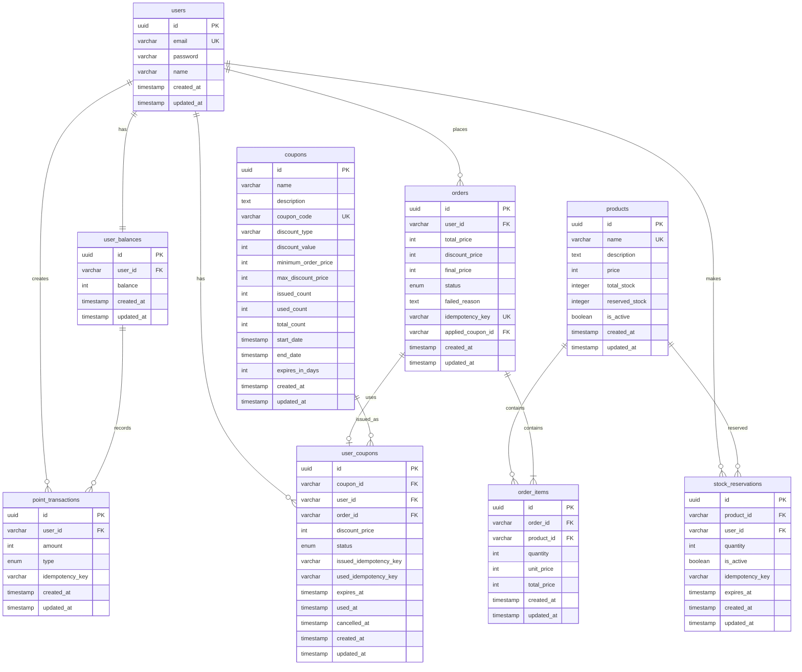

# ERD (Entity Relationship Diagram)

## 전체 시스템 ERD

## 테이블 정의

### 1. users (사용자)

| 컬럼       | 타입         | 제약조건                  | 설명               |
| ---------- | ------------ | ------------------------- | ------------------ |
| id         | UUID         | PRIMARY KEY               | 사용자 ID          |
| email      | VARCHAR(255) | UNIQUE, NOT NULL          | 이메일 (로그인 ID) |
| password   | VARCHAR(255) | NOT NULL                  | 암호화된 비밀번호  |
| name       | VARCHAR(100) | NOT NULL                  | 사용자 이름        |
| created_at | TIMESTAMP    | DEFAULT CURRENT_TIMESTAMP | 생성일시           |
| updated_at | TIMESTAMP    | DEFAULT CURRENT_TIMESTAMP | 수정일시           |

### 2. products (상품)

| 컬럼           | 타입         | 제약조건                  | 설명                |
| -------------- | ------------ | ------------------------- | ------------------- |
| id             | UUID         | PRIMARY KEY               | 상품 ID             |
| name           | VARCHAR(255) | UNIQUE, NOT NULL          | 상품명              |
| description    | TEXT         | NOT NULL                  | 상품 설명           |
| price          | INT          | NOT NULL                  | 상품 가격 (원 단위) |
| total_stock    | INTEGER      | NOT NULL, DEFAULT 0       | 총 재고 수량        |
| reserved_stock | INTEGER      | DEFAULT 0                 | 예약된 재고 수량    |
| is_active      | BOOLEAN      | NOT NULL, DEFAULT TRUE    | 활성화 상태         |
| created_at     | TIMESTAMP    | DEFAULT CURRENT_TIMESTAMP | 생성일시            |
| updated_at     | TIMESTAMP    | DEFAULT CURRENT_TIMESTAMP | 수정일시            |

### 3. orders (주문)

| 컬럼              | 타입         | 제약조건                  | 설명                                            |
| ----------------- | ------------ | ------------------------- | ----------------------------------------------- |
| id                | UUID         | PRIMARY KEY               | 주문 ID                                         |
| user_id           | VARCHAR(255) | NOT NULL, FOREIGN KEY     | 사용자 ID                                       |
| total_price       | INT          | NOT NULL                  | 총 주문 금액                                    |
| discount_price    | INT          | DEFAULT 0                 | 할인 금액                                       |
| final_price       | INT          | NOT NULL                  | 최종 결제 금액                                  |
| status            | ENUM         | NOT NULL                  | 주문 상태 (PENDING, SUCCESS, FAILED, CANCELLED) |
| failed_reason     | TEXT         | NULLABLE                  | 실패 사유                                       |
| idempotency_key   | VARCHAR(255) | UNIQUE, NOT NULL          | 중복 요청 방지 ID                               |
| applied_coupon_id | VARCHAR(255) | FOREIGN KEY, NULLABLE     | 적용된 쿠폰 ID                                  |
| created_at        | TIMESTAMP    | DEFAULT CURRENT_TIMESTAMP | 생성일시                                        |
| updated_at        | TIMESTAMP    | DEFAULT CURRENT_TIMESTAMP | 수정일시                                        |

### 4. order_items (주문 항목)

| 컬럼        | 타입         | 제약조건                  | 설명         |
| ----------- | ------------ | ------------------------- | ------------ |
| id          | UUID         | PRIMARY KEY               | 주문 항목 ID |
| order_id    | VARCHAR(255) | NOT NULL, FOREIGN KEY     | 주문 ID      |
| product_id  | VARCHAR(255) | NOT NULL, FOREIGN KEY     | 상품 ID      |
| quantity    | INT          | NOT NULL                  | 주문 수량    |
| unit_price  | INT          | NOT NULL                  | 단가         |
| total_price | INT          | NOT NULL                  | 항목 총 가격 |
| created_at  | TIMESTAMP    | DEFAULT CURRENT_TIMESTAMP | 생성일시     |
| updated_at  | TIMESTAMP    | DEFAULT CURRENT_TIMESTAMP | 수정일시     |

### 5. coupons (쿠폰)

| 컬럼                | 타입         | 제약조건                  | 설명                          |
| ------------------- | ------------ | ------------------------- | ----------------------------- |
| id                  | UUID         | PRIMARY KEY               | 쿠폰 ID                       |
| name                | VARCHAR(255) | NOT NULL                  | 쿠폰명                        |
| description         | TEXT         | NOT NULL                  | 쿠폰 설명                     |
| coupon_code         | VARCHAR(100) | UNIQUE, NOT NULL          | 쿠폰 코드                     |
| discount_type       | VARCHAR(20)  | NOT NULL                  | 할인 타입 (FIXED, PERCENTAGE) |
| discount_value      | INT          | NOT NULL                  | 할인값 (% 또는 고정금액)      |
| minimum_order_price | INT          | NOT NULL                  | 최소 주문 금액                |
| max_discount_price  | INT          | NULLABLE                  | 최대 할인 금액                |
| issued_count        | INT          | DEFAULT 0                 | 발급된 수량                   |
| used_count          | INT          | DEFAULT 0                 | 사용된 수량                   |
| total_count         | INT          | NOT NULL                  | 총 발급 가능 수량             |
| start_date          | TIMESTAMP    | NOT NULL                  | 유효 시작일                   |
| end_date            | TIMESTAMP    | NOT NULL                  | 유효 종료일                   |
| expires_in_days     | INT          | NOT NULL                  | 발급 후 만료일 (일 단위)      |
| created_at          | TIMESTAMP    | DEFAULT CURRENT_TIMESTAMP | 생성일시                      |
| updated_at          | TIMESTAMP    | DEFAULT CURRENT_TIMESTAMP | 수정일시                      |

### 6. user_coupons (사용자 쿠폰)

| 컬럼                   | 타입         | 제약조건                  | 설명                           |
| ---------------------- | ------------ | ------------------------- | ------------------------------ |
| id                     | UUID         | PRIMARY KEY               | 사용자 쿠폰 ID                 |
| coupon_id              | VARCHAR(255) | NOT NULL, FOREIGN KEY     | 쿠폰 ID                        |
| user_id                | VARCHAR(255) | NOT NULL, FOREIGN KEY     | 사용자 ID                      |
| order_id               | VARCHAR(255) | FOREIGN KEY, NULLABLE     | 사용된 주문 ID                 |
| discount_price         | INT          | NULLABLE                  | 실제 할인된 금액               |
| status                 | ENUM         | NOT NULL                  | 상태 (ISSUED, USED, CANCELLED) |
| issued_idempotency_key | VARCHAR(255) | NULLABLE                  | 발급 중복 방지 키              |
| used_idempotency_key   | VARCHAR(255) | NULLABLE                  | 사용 중복 방지 키              |
| expires_at             | TIMESTAMP    | NOT NULL                  | 만료일시                       |
| used_at                | TIMESTAMP    | NULLABLE                  | 사용일시                       |
| cancelled_at           | TIMESTAMP    | NULLABLE                  | 취소일시                       |
| created_at             | TIMESTAMP    | DEFAULT CURRENT_TIMESTAMP | 발급일시                       |
| updated_at             | TIMESTAMP    | DEFAULT CURRENT_TIMESTAMP | 수정일시                       |

### 7. user_balances (사용자 잔액)

| 컬럼       | 타입         | 제약조건                  | 설명             |
| ---------- | ------------ | ------------------------- | ---------------- |
| id         | UUID         | PRIMARY KEY               | 잔액 ID          |
| user_id    | VARCHAR(255) | NOT NULL, FOREIGN KEY     | 사용자 ID        |
| balance    | INT          | NOT NULL, DEFAULT 0       | 사용 가능한 잔액 |
| created_at | TIMESTAMP    | DEFAULT CURRENT_TIMESTAMP | 생성일시         |
| updated_at | TIMESTAMP    | DEFAULT CURRENT_TIMESTAMP | 수정일시         |

### 8. point_transactions (포인트 거래)

| 컬럼            | 타입         | 제약조건                  | 설명                             |
| --------------- | ------------ | ------------------------- | -------------------------------- |
| id              | UUID         | PRIMARY KEY               | 거래 ID                          |
| user_id         | VARCHAR(255) | NOT NULL, FOREIGN KEY     | 사용자 ID                        |
| amount          | INT          | NOT NULL                  | 거래 금액                        |
| type            | ENUM         | NOT NULL                  | 거래 타입 (CHARGE, USE, RECOVER) |
| idempotency_key | VARCHAR(255) | NOT NULL                  | 중복 방지 키                     |
| created_at      | TIMESTAMP    | DEFAULT CURRENT_TIMESTAMP | 생성일시                         |
| updated_at      | TIMESTAMP    | DEFAULT CURRENT_TIMESTAMP | 수정일시                         |

### 9. stock_reservations (재고 예약)

| 컬럼            | 타입         | 제약조건                  | 설명                        |
| --------------- | ------------ | ------------------------- | --------------------------- |
| id              | UUID         | PRIMARY KEY               | 예약 ID                     |
| product_id      | VARCHAR(255) | NOT NULL, FOREIGN KEY     | 상품 ID                     |
| user_id         | VARCHAR(255) | NOT NULL, FOREIGN KEY     | 사용자 ID                   |
| quantity        | INT          | NOT NULL                  | 예약 수량                   |
| is_active       | BOOLEAN      | NOT NULL, DEFAULT TRUE    | 활성화 상태                 |
| idempotency_key | VARCHAR(255) | NOT NULL                  | 중복 방지 키                |
| expires_at      | TIMESTAMP    | NOT NULL                  | 예약 만료일시 (생성 + 30초) |
| created_at      | TIMESTAMP    | DEFAULT CURRENT_TIMESTAMP | 예약 생성일시               |
| updated_at      | TIMESTAMP    | DEFAULT CURRENT_TIMESTAMP | 수정일시                    |
