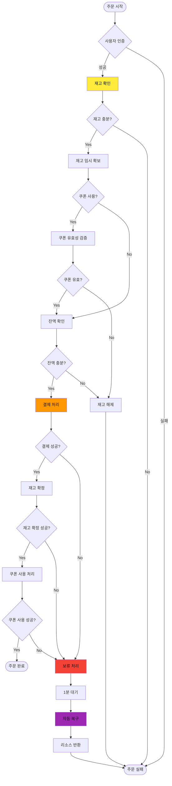

# 📋 이커머스 상품 주문 시스템 기술 명세서

## 1. 시스템 개요

### 1.1 목적

디지털 상품 주문 및 결제 시스템으로, 사용자 잔액과 쿠폰을 활용한 안전한 거래 처리를 제공합니다.

### 1.2 주요 기능

- 사용자 잔액 충전 및 관리
- 디지털 상품 주문 및 결제
- 선착순 쿠폰 발급 및 사용
- 재고 관리 및 동시성 제어
- 실패 상황 자동 복구
- 인기 상품 통계 및 추천

## 2. 시스템 아키텍처

### 2.1 전체 구조

```mermaid
graph TB
    subgraph "Load Balancer"
        LB[Load Balancer]
    end

    subgraph "Application Instances"
        I1[Instance 1]
        I2[Instance 2]
        I3[Instance 3]
    end

    subgraph "Shared Resources"
        DB[(MySQL)]
        R[(Redis)]
        K[(Kafka)]
    end

    subgraph "Critical Sections"
        CS1[재고 관리]
        CS2[쿠폰 발급]
        CS3[배치 작업]
    end

    LB --> I1
    LB --> I2
    LB --> I3

    I1 --> DB
    I2 --> DB
    I3 --> DB

    I1 --> R
    I2 --> R
    I3 --> R

    I1 --> K
    I2 --> K
    I3 --> K

    I1 -.-> CS1
    I2 -.-> CS1
    I3 -.-> CS1

    I1 -.-> CS2
    I2 -.-> CS2
    I3 -.-> CS2

    I1 -.-> CS3
    I2 -.-> CS3
    I3 -.-> CS3

    CS1 --> DB
    CS2 --> R
    CS3 --> R

    style CS1 fill:#333
    style CS2 fill:#333
    style CS3 fill:#333
```



**동시성 제어 영역 설명:**

- **CS1 (재고 관리)**: DB 필드 기반 reserve/release 패턴
- **CS2 (쿠폰 발급)**: Redis 원자적 연산 (INCR/DECR)
- **CS3 (보류 주문 복구)**: Redis 분산 락 (SET NX EX)

### 2.2 모듈 구조

```
src/
├── auth/           # JWT 인증 및 사용자 관리
├── user/           # 사용자 프로필 관리
├── product/        # 상품 조회 및 관리
├── order/          # 주문 처리 핵심 로직
├── wallet/         # 잔액 충전 및 결제
├── coupon/         # 쿠폰 발급 및 사용
├── stats/          # 인기 상품 통계
├── recovery/       # 실패 주문 복구
└── database/       # 데이터베이스 설정
```

## 3. 기술 스택

| 구분         | 기술         | 버전  | 목적                                          |
| ------------ | ------------ | ----- | --------------------------------------------- |
| 런타임       | Node.js      | 18.x  | 서버 사이드 JavaScript 실행                   |
| 프레임워크   | NestJS       | 10.x  | 엔터프라이즈급 Node.js 프레임워크             |
| 데이터베이스 | MySQL        | 8.x   | 관계형 데이터 저장 및 트랜잭션                |
| 캐시         | Redis        | 7.x   | 쿠폰 발급 동시성 제어, 보류 주문 복구 분산 락 |
| 메시징       | Kafka (Mock) | -     | 주문 이벤트 로깅                              |
| ORM          | TypeORM      | 0.3.x | 데이터베이스 ORM                              |
| 인증         | JWT          | -     | 무상태 인증                                   |

## 4. 핵심 비즈니스 플로우

### 4.1 주문 처리 플로우



## 5. 데이터 모델 및 제약사항

### 5.1 핵심 엔티티

| 엔티티          | 주요 속성                                       | 비즈니스 규칙                  |
| --------------- | ----------------------------------------------- | ------------------------------ |
| **User**        | id, email, name                                 | 이메일 중복 불가               |
| **Product**     | id, name, price, total_stock, reserved_stock    | 가격은 100원 단위, 재고는 양수 |
| **Order**       | id, user_id, total_amount, final_amount, status | 최종 금액은 양수, 상태별 처리  |
| **UserBalance** | user_id, balance                                | 최소 0원, 최대 천만원          |
| **Coupon**      | id, code, type, discount_value, total_quantity  | 사용량 ≤ 총량                  |
| **UserCoupon**  | user_id, coupon_id, status                      | 사용자당 중복 발급 불가        |

### 5.2 데이터 무결성 제약

#### 금액 처리 정책

- **모든 금액은 정수(원 단위)로 처리** - 부동소수점 오차 방지
- 할인 계산 시 **소수점 버림** 적용: `할인금액 = 원가 × 할인율 ÷ 100` (정수 나눗셈)
- 예시: 1,235원 × 10% = 123원 (소수점 버림)

#### 재고 관리 제약

- `total_stock ≥ reserved_stock ≥ 0`
- `available_stock = total_stock - reserved_stock`
- 상품당 최대 주문 수량: 10개
- 한 주문 내 총 수량: 최대 30개

#### 잔액 관리 제약

- `balance ≥ 0` (음수 잔액 불가)
- 최소 충전: 1,000원, 최대 충전: 100,000원
- 총 보유 한도: 10,000,000원
- 충전 단위: 10원

## 6. 동시성 제어 전략

### 6.1 재고 관리

**Reserve/Release 패턴 (DB 필드 기반)**

```sql
-- 재고 예약
UPDATE products
SET reserved_stock = reserved_stock + ?
WHERE id = ? AND (total_stock - reserved_stock) >= ?

-- 재고 확정
UPDATE products
SET total_stock = total_stock - ?, reserved_stock = reserved_stock - ?
WHERE id = ?

-- 재고 해제
UPDATE products
SET reserved_stock = reserved_stock - ?
WHERE id = ?
```

**TTL 기반 자동 해제**

- 30초 후 자동 예약 해제
- 5분마다 배치로 만료된 예약 정리

### 6.2 쿠폰 발급 (Redis 원자적 연산)

```javascript
// 선착순 쿠폰 발급
const usedCount = await redis.incr(`coupon:used:${couponCode}`);
const totalCount = await redis.get(`coupon:total:${couponCode}`);

if (usedCount > parseInt(totalCount)) {
  await redis.decr(`coupon:used:${couponCode}`); // 롤백
  throw new Error("쿠폰 소진");
}
```

### 6.3 보류 주문 복구 (Redis 분산 락)

```javascript
// 중복 배치 실행 방지
const lockKey = `recovery:${orderId}`;
const lockAcquired = await redis.set(lockKey, "locked", "PX", 60000, "NX");

if (lockAcquired === "OK") {
  try {
    await recoverOrder(orderId);
  } finally {
    await redis.del(lockKey);
  }
}
```

### 6.4 잔액 관리 (비관적 락)

```sql
-- 잔액 차감 시 행 단위 락
SELECT balance FROM user_balances WHERE user_id = ? FOR UPDATE;
UPDATE user_balances SET balance = balance - ? WHERE user_id = ?;
```

## 7. 성능 및 확장성

### 7.1 성능 지표

| 메트릭             | 목표값   | 측정 방법                |
| ------------------ | -------- | ------------------------ |
| 주문 처리 지연시간 | < 2초    | API 응답 시간 측정       |
| 동시 주문 처리량   | 1000 TPS | 부하 테스트              |
| 재고 충돌 실패율   | < 5%     | 동시 주문 시 실패 비율   |
| 자동 복구 성공률   | > 99%    | 보류 주문 복구 성공 비율 |

### 7.2 확장성 고려사항

#### 수평 확장 (Scale-out)

- **무상태 API**: JWT 토큰 기반 인증으로 세션 의존성 제거
- **데이터베이스 분할**: 사용자 기반 샤딩 고려 (현재는 유저 데이터 끼리의 소통이 없음!)
- **Redis 분산**: 쿠폰 발급 및 분산 락용 Redis Cluster 도입 가능
- **웹 서버 복제**: 오토 스케일링 로드 밸런서 도입 가능

#### 성능 최적화

- **인기 상품 통계**: 별도 집계 테이블 또는 Redis 캐시 활용 (3일간 판매량 기준)
- **파티셔닝**: `point_transactions`, `orders` 테이블 월별 파티셔닝
- **인덱스 최적화**:
  - `orders`: (user_id), (status), (created_at)
  - `products`: (is_active), (total_stock)
  - `user_coupons`: (user_id, coupon_id) 복합 유니크

## 8. 예외 처리 및 복구

### 8.1 실패 시나리오별 처리

| 실패 원인    | 처리 방식 | 복구 방법        |
| ------------ | --------- | ---------------- |
| 잔액 부족    | 주문 거절 | 재고 예약 해제   |
| 재고 부족    | 주문 거절 | 즉시 실패 응답   |
| 쿠폰 오류    | 주문 거절 | 재고 예약 해제   |
| 결제 중 오류 | 보류 처리 | 1분 후 자동 복구 |

### 8.2 자동 복구 시스템

- **보류 주문**: 1분 후 잔액/재고/쿠폰 자동 복원
- **만료 예약**: 30초 후 재고 예약 자동 해제
- **분산 락 TTL**: Redis 내에서 60초 후 자동 락 해제 (프로세스 장애 대비)

### 8.3 중복 요청 방지

- **멱등성 키**: 클라이언트 요청 시 `requestId` 포함 (프론트에서 생성해야할듯)
- **중복 검증**: 동일 `requestId` 기존 결과 반환
- **동시 요청**: 최초 승인만 유효, 나머지 실패 처리

## 9. 보안 및 제한 정책

### 9.1 사용자 행위 제한

- 주문 요청: **초당 1회 이하**
- 쿠폰 발급: **1분당 최대 3회**
- 연속 실패: **5회 연속 실패 시 10분간 제한**

### 9.2 데이터 보존

- **거래 이력**: `point_transactions` 삭제 불가 (INSERT ONLY)
- **주문 이력**: `orders`, `order_items` 삭제 불가, 상태만 변경
- **감사 추적**: 모든 잔액 변동 기록 의무

## 10. 모니터링 및 알림

### 10.1 핵심 메트릭

- 주문 성공률, 결제 실패율
- 재고 충돌 발생률
- 자동 복구 성공률
- API 응답 시간 분포

### 10.2 알림 기준

- 결제 실패율 > 10%
- 자동 복구 실패율 > 1%
- API 응답 시간 > 3초
- 동시 접속자 > 임계값
